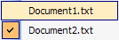

# Expander Buttons

Expander buttons are represented using the [BarExpanderButtonCommand](xref:ActiproSoftware.UI.WinForms.Controls.Bars.BarExpanderButtonCommand) and a [BarExpanderButtonLink](xref:ActiproSoftware.UI.WinForms.Controls.Bars.BarExpanderButtonLink) classes.  The [BarExpanderButtonCommand](xref:ActiproSoftware.UI.WinForms.Controls.Bars.BarExpanderButtonCommand) class is the base command for the [BarExpanderButtonLink](xref:ActiproSoftware.UI.WinForms.Controls.Bars.BarExpanderButtonLink), which is the command link.

See the [Commands and Command Links](index.md) topic for more information on commands and command links and how they relate to each other.

Expander buttons are used in situations what dynamically generated child command links are appropriate.  For instance, MDI window lists, toolbar lists, and recent files lists are the perfect places to use an expander.  Expander buttons appear like a button when on a toolbar and are replaced by their child command links when on a menu.  The expander button on a toolbar can be clicked to display a menu of the child command links.

## Child Command Links and Menus

Clicking a expander button on a toolbar displays a menu containing the command links found in the [CommandLinks](xref:ActiproSoftware.UI.WinForms.Controls.Bars.BarExpanderButtonCommand.CommandLinks) collection on the command instance.  The menu uses a resolved setting from the command link's [UseToolBarStyleForPopupMenu](xref:ActiproSoftware.UI.WinForms.Controls.Bars.BarExpanderButtonLink.UseToolBarStyleForPopupMenu) property and the command's [UseToolBarStyleForPopupMenu](xref:ActiproSoftware.UI.WinForms.Controls.Bars.BarExpanderButtonCommand.UseToolBarStyleForPopupMenu) property to determine whether the menu should display in a toolbar style or not.  If the expander button is on menu, it is replaced by its child command links before the menu is displayed.

In both cases, the [CommandLinks](xref:ActiproSoftware.UI.WinForms.Controls.Bars.BarExpanderButtonCommand.CommandLinks) collection on the command can be modified as needed in the [CommandPopup](xref:ActiproSoftware.UI.WinForms.Controls.Bars.BarManager.CommandPopup) event, which is raised before the child command links are displayed.

## Text and Images

Each command has a text and image value.  The text value comes from the [Text](xref:ActiproSoftware.UI.WinForms.Controls.Bars.BarCommand.Text) property.  The image first looks at the [Image](xref:ActiproSoftware.UI.WinForms.Controls.Bars.BarCommand.Image) property.  If not specified, it looks to the [ImageIndex](xref:ActiproSoftware.UI.WinForms.Controls.Bars.BarCommand.ImageIndex) property.

Each command link instance can override all of these properties as well with command link-specific property values.  The command link versions of the properties are examined first when resolving the text and image values.

## Enabling / Disabling

Command links can be enabled or disabled based on a resolved value of enabled properties, one on the command and one on the command link that can override it.  The command link's [Enabled](xref:ActiproSoftware.UI.WinForms.Controls.Bars.BarCommandLink.Enabled) accepts a `DefaultableBoolean`, which can override the command's [Enabled](xref:ActiproSoftware.UI.WinForms.Controls.Bars.BarCommand.Enabled) property.

## Begin a Group

The [BeginAGroup](xref:ActiproSoftware.UI.WinForms.Controls.Bars.BarCommandLink.BeginAGroup) property on each command link indicates whether the command link begins a group.  If it does, a separator will be drawn before it.

## Display Styles

The [DisplayStyle](xref:ActiproSoftware.UI.WinForms.Controls.Bars.BarCommandLink.DisplayStyle) property on each command link accepts a [BarCommandLinkDisplayStyle](xref:ActiproSoftware.UI.WinForms.Controls.Bars.BarCommandLinkDisplayStyle) enumeration value that indicates how to render the command link in terms of image and text display.

## Visibility

The [Visible](xref:ActiproSoftware.UI.WinForms.Controls.Bars.BarCommandLink.Visible) property on each command link controls whether the command link is visible or invisible within its parent bar control.

## Tooltips

Tooltips will be displayed for the command if the [ToolTipEnabled](xref:ActiproSoftware.UI.WinForms.Controls.Bars.BarCommand.ToolTipEnabled) property is set to `true`.  The tooltip will display the value of the [Text](xref:ActiproSoftware.UI.WinForms.Controls.Bars.BarCommand.Text) property unless the [ToolTipText](xref:ActiproSoftware.UI.WinForms.Controls.Bars.BarCommand.ToolTipText) property overrides it with a different value.  The [ToolTipText](xref:ActiproSoftware.UI.WinForms.Controls.Bars.BarCommand.ToolTipText) property can be left as `null` to indicate to use the [Text](xref:ActiproSoftware.UI.WinForms.Controls.Bars.BarCommand.Text) property instead.

## Changing the Text Displayed in the Run-Time Customize Dialog for the Command

By default, the [Text](xref:ActiproSoftware.UI.WinForms.Controls.Bars.BarCommand.Text) property value of the command will be displayed in the run-time customize dialog's command listbox.  However if this is not appropriate or needs to be customized for the command listbox, the [CustomizeListText](xref:ActiproSoftware.UI.WinForms.Controls.Bars.BarCommand.CustomizeListText) property can be set to override what is displayed.
