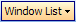
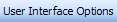
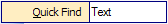
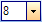

# Overview

The most important concept to understand with the bar controls is the concept of *commands* and *command links*.  Since the bar controls are fairly advanced, understanding this concept is key before using them.  Be sure to thoroughly read this topic before moving on to using the bar controls.

A command is any object that inherits from [BarCommand](xref:@ActiproUIRoot.Controls.Bars.BarCommand).  Commands represent a specific functionality of your application, such as creating a new document.  A command *does not* have a user interface.  Changes made to a command affect all the command links that reference it.

A command link is any object that inherits from [BarCommandLink](xref:@ActiproUIRoot.Controls.Bars.BarCommandLink).  A command link provides the user interface for a command.  So, each command link references a specific command.  One or more command links can be created for each command.  Changes made to command link properties only affect that particular command link instance.

## Command Categories and Names

Each command has a unique key, known in the bar controls as a *full name*.  The full name can be returned via the [BarCommand](xref:@ActiproUIRoot.Controls.Bars.BarCommand).[FullName](xref:@ActiproUIRoot.Controls.Bars.BarCommand.FullName) property.

The full name is a concatenation of a category and a command name, with a period (`.`) in between.  This allows commands to easily be categorized and for some names to be used more than once, in different categories.

For instance, typical commands on a **File** menu are **New**, **Open**, etc.  In Bars, the full name of these commands would be `"File.New"` and `"File.Open"`, where the category of the command is `"File"` and the names of the commands are `"New"` and `"Open"` respectively.

> [!NOTE]
> The full name is the primary method of accessing and identifying commands.

## Command / Command Link Types

There are a number of built-in command and command link types that each provide distinct functionality.  Each command has a corresponding command link type.

This table illustrates each command and command link `Type`:

<table>
<thead>

<tr>
<th>Command Name (Command Link Name)</th>
<th>Description</th>
</tr>

</thead>
<tbody>

<tr>
<td>

[BarButtonCommand](xref:@ActiproUIRoot.Controls.Bars.BarButtonCommand) ([BarButtonLink](xref:@ActiproUIRoot.Controls.Bars.BarButtonLink))

</td>
<td>

Represents a standard button (on a toolbar) or menu item (on a menu), that can be pushed.  It also supports a checked state.

</td>
</tr>

<tr>
<td>

[BarPopupButtonCommand](xref:@ActiproUIRoot.Controls.Bars.BarPopupButtonCommand) ([BarPopupButtonLink](xref:@ActiproUIRoot.Controls.Bars.BarPopupButtonLink))

</td>
<td>

Represents a root menu item button (on a toolbar) or menu item (on a menu).  The link has a collection of child command links that generate a child menu when the link is pressed.

</td>
</tr>

<tr>
<td>

[BarSplitButtonCommand](xref:@ActiproUIRoot.Controls.Bars.BarSplitButtonCommand) ([BarSplitButtonLink](xref:@ActiproUIRoot.Controls.Bars.BarSplitButtonLink))

</td>
<td>

Represents a split button where one part acts like a normal button and the other part has a drop-down arrow and displays a menu when pressed.  The button supports a checked state.  The link has a collection of child command links that generate the menu when the link is pressed.

</td>
</tr>

<tr>
<td>

[BarExpanderButtonCommand](xref:@ActiproUIRoot.Controls.Bars.BarExpanderButtonCommand) ([BarExpanderButtonLink](xref:@ActiproUIRoot.Controls.Bars.BarExpanderButtonLink))

</td>
<td>

Represents a button that has dynamically-generated child command links.  These can be a list of toolbars, windows open, or anything else.  When on a toolbar, the command link functionality is similar to a [BarPopupButtonLink](xref:@ActiproUIRoot.Controls.Bars.BarPopupButtonLink).  When on a menu, the command link is replaced by the child command links.

</td>
</tr>

<tr>
<td>

[BarLabelCommand](xref:@ActiproUIRoot.Controls.Bars.BarLabelCommand) ([BarLabelLink](xref:@ActiproUIRoot.Controls.Bars.BarLabelLink))

</td>
<td>

Represents a static label that can display text and images.

</td>
</tr>

<tr>
<td>

[BarTextBoxCommand](xref:@ActiproUIRoot.Controls.Bars.BarTextBoxCommand) ([BarTextBoxLink](xref:@ActiproUIRoot.Controls.Bars.BarTextBoxLink))

</td>
<td>

Represents a textbox that accepts text input.

</td>
</tr>

<tr>
<td>

[BarComboBoxCommand](xref:@ActiproUIRoot.Controls.Bars.BarComboBoxCommand) ([BarComboBoxLink](xref:@ActiproUIRoot.Controls.Bars.BarComboBoxLink))

</td>
<td>

Represents a combobox that can display a drop-down list of pre-defined values.  The combobox text area can be editable or read-only.

</td>
</tr>

</tbody>
</table>

## Creating Command Links

The easiest way to create a command link for a command is to call the [CreateCommandLink](xref:@ActiproUIRoot.Controls.Bars.BarCommand.CreateCommandLink*) method on the command.  A command link is returned that references the command and can be programmatically added to any bar control.

## Cloning Command Links

Command links can be cloned by using the [Clone](xref:@ActiproUIRoot.Controls.Bars.BarCommandLink.Clone*) method.

## Preventing Menus from Closing When a Link Is Clicked

When used on a menu, command links normally close the menu when they are clicked.  However, in some cases it is useful to keep the menu open so that the link may be immediately clicked again.  For these scenarios, you can set the [StaysOpenOnClick](xref:@ActiproUIRoot.Controls.Bars.BarCommand.StaysOpenOnClick) property to `true` to keep a menu open when a link for the command is clicked.
