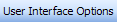

# Labels

Labels are represented using the [BarLabelCommand](xref:ActiproSoftware.UI.WinForms.Controls.Bars.BarLabelCommand) and a [BarLabelLink](xref:ActiproSoftware.UI.WinForms.Controls.Bars.BarLabelLink) classes.  The [BarLabelCommand](xref:ActiproSoftware.UI.WinForms.Controls.Bars.BarLabelCommand) class is the base command for the [BarLabelLink](xref:ActiproSoftware.UI.WinForms.Controls.Bars.BarLabelLink), which is the command link.

See the [Commands and Command Links](index.md) topic for more information on commands and command links and how they relate to each other.

Labels appear like static text when on a toolbar and appear like block heading when on a menu.

## Text and Images

Each command has a text and image value.  The text value comes from the [Text](xref:ActiproSoftware.UI.WinForms.Controls.Bars.BarCommand.Text) property.  The image first looks at the [Image](xref:ActiproSoftware.UI.WinForms.Controls.Bars.BarCommand.Image) property.  If not specified, it looks to the [ImageIndex](xref:ActiproSoftware.UI.WinForms.Controls.Bars.BarCommand.ImageIndex) property.

Each command link instance can override all of these properties as well with command link-specific property values.  The command link versions of the properties are examined first when resolving the text and image values.

## Begin a Group

The [BeginAGroup](xref:ActiproSoftware.UI.WinForms.Controls.Bars.BarCommandLink.BeginAGroup) property on each command link indicates whether the command link begins a group.  If it does, a separator will be drawn before it.

## Display Styles

The [DisplayStyle](xref:ActiproSoftware.UI.WinForms.Controls.Bars.BarCommandLink.DisplayStyle) property on each command link accepts a [BarCommandLinkDisplayStyle](xref:ActiproSoftware.UI.WinForms.Controls.Bars.BarCommandLinkDisplayStyle) enumeration value that indicates how to render the command link in terms of image and text display.

## Visibility

The [Visible](xref:ActiproSoftware.UI.WinForms.Controls.Bars.BarCommandLink.Visible) property on each command link controls whether the command link is visible or invisible within its parent bar control.

## Tooltips

Tooltips will be displayed for the command if the [ToolTipEnabled](xref:ActiproSoftware.UI.WinForms.Controls.Bars.BarCommand.ToolTipEnabled) property is set to `true`.  The tooltip will display the value of the [Text](xref:ActiproSoftware.UI.WinForms.Controls.Bars.BarCommand.Text) property unless the [ToolTipText](xref:ActiproSoftware.UI.WinForms.Controls.Bars.BarCommand.ToolTipText) property overrides it with a different value.  The [ToolTipText](xref:ActiproSoftware.UI.WinForms.Controls.Bars.BarCommand.ToolTipText) property can be left as `null` to indicate to use the [Text](xref:ActiproSoftware.UI.WinForms.Controls.Bars.BarCommand.Text) property instead.

## Changing the Text Displayed in the Run-Time Customize Dialog for the Command

By default, the [Text](xref:ActiproSoftware.UI.WinForms.Controls.Bars.BarCommand.Text) property value of the command will be displayed in the run-time customize dialog's command listbox.  However if this is not appropriate or needs to be customized for the command listbox, the [CustomizeListText](xref:ActiproSoftware.UI.WinForms.Controls.Bars.BarCommand.CustomizeListText) property can be set to override what is displayed.
