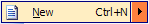

# Split Buttons

Split buttons are represented using the [BarSplitButtonCommand](xref:@ActiproUIRoot.Controls.Bars.BarSplitButtonCommand) and a [BarSplitButtonLink](xref:@ActiproUIRoot.Controls.Bars.BarSplitButtonLink) classes.  The [BarSplitButtonCommand](xref:@ActiproUIRoot.Controls.Bars.BarSplitButtonCommand) class is the base command for the [BarSplitButtonLink](xref:@ActiproUIRoot.Controls.Bars.BarSplitButtonLink), which is the command link.

See the [Commands and Command Links](index.md) topic for more information on commands and command links and how they relate to each other.

Split buttons appear like a button but with an additional drop-down button when on a toolbar and appear like a normal menu item but with a special clickable popup menu area when on a menu.  The main button part of a split button can be clicked and an action can be taken in response to the click.  The drop-down button part of a split button can be clicked to display a menu.

## Checkable Buttons

Split buttons can optionally become checkable and can be used in check groups.  These options are set up on the command.  See the [Checkable Buttons](../checkable-buttons.md) topic for detailed information on working with checkable buttons.

## Child Command Links and Menus

Clicking the drop-down part of a split button displays a menu containing the command links found in the [CommandLinks](xref:@ActiproUIRoot.Controls.Bars.BarSplitButtonLink.CommandLinks) collection on the command link instance.  The menu uses a resolved setting from the command link's [UseToolBarStyleForPopupMenu](xref:@ActiproUIRoot.Controls.Bars.BarSplitButtonLink.UseToolBarStyleForPopupMenu) property and the command's [UseToolBarStyleForPopupMenu](xref:@ActiproUIRoot.Controls.Bars.BarSplitButtonCommand.UseToolBarStyleForPopupMenu) property to determine whether the menu should display in a toolbar style or not.

Whenever a [BarSplitButtonLink](xref:@ActiproUIRoot.Controls.Bars.BarSplitButtonLink) is created from a [BarSplitButtonCommand](xref:@ActiproUIRoot.Controls.Bars.BarSplitButtonCommand), the command's [DefaultCommandLinks](xref:@ActiproUIRoot.Controls.Bars.BarSplitButtonCommand.DefaultCommandLinks) property is used to auto-fill the command link's [CommandLinks](xref:@ActiproUIRoot.Controls.Bars.BarSplitButtonLink.CommandLinks) collection.  Further code-based customization can also occur by handling the [CustomizeCommandLinkCreated](xref:@ActiproUIRoot.Controls.Bars.BarManager.CustomizeCommandLinkCreated) event.

## Tear-Off Menus

The popup menu displayed by the split button can optionally have a gripper placed on it, allowing it to torn off into a floating toolbar by the end user.  To allow this feature, set the command's [CanTearOff](xref:@ActiproUIRoot.Controls.Bars.BarSplitButtonCommand.CanTearOff) property to `true`.  Since split buttons don't have a toolbar key associated with them and a toolbar is created when tearing off a menu, the toolbar needs to know what key to use for displaying in customize dialogs, etc.  This toolbar key is set using the command's [TearOffDockableToolBarKey](xref:@ActiproUIRoot.Controls.Bars.BarSplitButtonCommand.TearOffDockableToolBarKey) property.

When a tear-off occurs, the [MenuTearOff](xref:@ActiproUIRoot.Controls.Bars.BarManager.MenuTearOff) event on the [BarManager](xref:@ActiproUIRoot.Controls.Bars.BarManager) is raised.

## Text and Images

Each command has a text and image value.  The text value comes from the [Text](xref:@ActiproUIRoot.Controls.Bars.BarCommand.Text) property.  The image first looks at the [Image](xref:@ActiproUIRoot.Controls.Bars.BarCommand.Image) property.  If not specified, it looks to the [ImageIndex](xref:@ActiproUIRoot.Controls.Bars.BarCommand.ImageIndex) property.

Each command link instance can override all of these properties as well with command link-specific property values.  The command link versions of the properties are examined first when resolving the text and image values.

## Enabling / Disabling

Command links can be enabled or disabled based on a resolved value of enabled properties, one on the command and one on the command link that can override it.  The command link's [Enabled](xref:@ActiproUIRoot.Controls.Bars.BarCommandLink.Enabled) accepts a `DefaultableBoolean`, which can override the command's [Enabled](xref:@ActiproUIRoot.Controls.Bars.BarCommand.Enabled) property.

## Keyboard Shortcuts

Keyboard shortcuts can be set to the command by adding the appropriate [BarKeyboardShortcut](xref:@ActiproUIRoot.Controls.Bars.BarKeyboardShortcut) instances to the [KeyboardShortcuts](xref:@ActiproUIRoot.Controls.Bars.BarCommand.KeyboardShortcuts) collection on the command.

See the [Keyboard Shortcuts](../keyboard-shortcuts.md) topic for more information on keyboard shortcuts.

## Begin a Group

The [BeginAGroup](xref:@ActiproUIRoot.Controls.Bars.BarCommandLink.BeginAGroup) property on each command link indicates whether the command link begins a group.  If it does, a separator will be drawn before it.

## Display Styles

The [DisplayStyle](xref:@ActiproUIRoot.Controls.Bars.BarCommandLink.DisplayStyle) property on each command link accepts a [BarCommandLinkDisplayStyle](xref:@ActiproUIRoot.Controls.Bars.BarCommandLinkDisplayStyle) enumeration value that indicates how to render the command link in terms of image and text display.

## Visibility

The [Visible](xref:@ActiproUIRoot.Controls.Bars.BarCommandLink.Visible) property on each command link controls whether the command link is visible or invisible within its parent bar control.

## Tooltips

Tooltips will be displayed for the command if the [ToolTipEnabled](xref:@ActiproUIRoot.Controls.Bars.BarCommand.ToolTipEnabled) property is set to `true`.  The tooltip will display the value of the [Text](xref:@ActiproUIRoot.Controls.Bars.BarCommand.Text) property unless the [ToolTipText](xref:@ActiproUIRoot.Controls.Bars.BarCommand.ToolTipText) property overrides it with a different value.  The [ToolTipText](xref:@ActiproUIRoot.Controls.Bars.BarCommand.ToolTipText) property can be left as `null` to indicate to use the [Text](xref:@ActiproUIRoot.Controls.Bars.BarCommand.Text) property instead.

## Changing the Text Displayed in the Run-Time Customize Dialog for the Command

By default, the [Text](xref:@ActiproUIRoot.Controls.Bars.BarCommand.Text) property value of the command will be displayed in the run-time customize dialog's command listbox.  However if this is not appropriate or needs to be customized for the command listbox, the [CustomizeListText](xref:@ActiproUIRoot.Controls.Bars.BarCommand.CustomizeListText) property can be set to override what is displayed.
