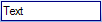

# Textboxes

Textboxes are represented using the [BarTextBoxCommand](xref:@ActiproUIRoot.Controls.Bars.BarTextBoxCommand) and a [BarTextBoxLink](xref:@ActiproUIRoot.Controls.Bars.BarTextBoxLink) classes.  The [BarTextBoxCommand](xref:@ActiproUIRoot.Controls.Bars.BarTextBoxCommand) class is the base command for the [BarTextBoxLink](xref:@ActiproUIRoot.Controls.Bars.BarTextBoxLink), which is the command link.

See the [Commands and Command Links](index.md) topic for more information on commands and command links and how they relate to each other.

Textboxes allow for entry of text.  The pressing of <kbd>Enter</kbd> or the changing of a value and tabbing off the textbox will raise the command click event.

## Obtaining the Textbox Value

The textbox value can be retrieved from the command's [ControlValue](xref:@ActiproUIRoot.Controls.Bars.BarCustomControlCommand.ControlValue) property.  This value will be displayed in all command link instances of the command.

## Setting the Width

The width of the textbox can be set using the command's [Width](xref:@ActiproUIRoot.Controls.Bars.BarCustomControlCommand.Width) property.

## Enabling / Disabling

Command links can be enabled or disabled based on a resolved value of enabled properties, one on the command and one on the command link that can override it.  The command link's [Enabled](xref:@ActiproUIRoot.Controls.Bars.BarCommandLink.Enabled) property accepts a `DefaultableBoolean`, which can override the command's [Enabled](xref:@ActiproUIRoot.Controls.Bars.BarCommand.Enabled) property.

## Keyboard Shortcuts

Keyboard shortcuts can be set to the command by adding the appropriate [BarKeyboardShortcut](xref:@ActiproUIRoot.Controls.Bars.BarKeyboardShortcut) instances to the [KeyboardShortcuts](xref:@ActiproUIRoot.Controls.Bars.BarCommand.KeyboardShortcuts) collection on the command.

See the [Keyboard Shortcuts](../keyboard-shortcuts.md) topic for more information on keyboard shortcuts.

## Begin a Group

The [BeginAGroup](xref:@ActiproUIRoot.Controls.Bars.BarCommandLink.BeginAGroup) property on each command link indicates whether the command link begins a group.  If it does, a separator will be drawn before it.

## Visibility

The [Visible](xref:@ActiproUIRoot.Controls.Bars.BarCommandLink.Visible) property on each command link controls whether the command link is visible or invisible within its parent bar control.

## Tooltips

Tooltips will be displayed for the command if the [ToolTipEnabled](xref:@ActiproUIRoot.Controls.Bars.BarCommand.ToolTipEnabled) property is set to `true`.  The tooltip will display the value of the [Text](xref:@ActiproUIRoot.Controls.Bars.BarCommand.Text) property unless the [ToolTipText](xref:@ActiproUIRoot.Controls.Bars.BarCommand.ToolTipText) property overrides it with a different value.  The [ToolTipText](xref:@ActiproUIRoot.Controls.Bars.BarCommand.ToolTipText) property can be left as `null` to indicate to use the [Text](xref:@ActiproUIRoot.Controls.Bars.BarCommand.Text) property instead.

## Changing the Text Displayed in the Run-Time Customize Dialog for the Command

By default, the [Text](xref:@ActiproUIRoot.Controls.Bars.BarCommand.Text) property value of the command will be displayed in the run-time customize dialog's command listbox.  However, if this is not appropriate or needs to be customized for the command listbox, the [CustomizeListText](xref:@ActiproUIRoot.Controls.Bars.BarCommand.CustomizeListText) property can be set to override what is displayed.
