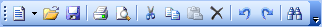
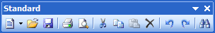
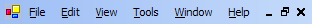
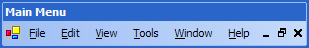

# Dockable Toolbars

Dockable toolbars, represented by the [DockableToolBar](xref:@ActiproUIRoot.Controls.Bars.DockableToolBar) class, provide most of the functionality seen in a bar layout.  Each toolbar is a movable container for one or more command links.  Dockable toolbars can be dragged by the end user and docked to any side of the host container control, or even floated above the form that contains the host container control.





All dockable toolbars should have a unique key and are added to a [BarManager](xref:@ActiproUIRoot.Controls.Bars.BarManager) via the [DockableToolBars](xref:@ActiproUIRoot.Controls.Bars.BarManager.DockableToolBars) collection.  The dockable toolbar [Key](xref:@ActiproUIRoot.Controls.Bars.DockableToolBar.Key) is used as an indexer in that collection.

## Grippers and Options Buttons

Dockable toolbars can display grippers (used to drag and dock the toolbar to another location) as well as options buttons.  When docked, a gripper appears on the side of the dockable toolbar and the options button appears on the other side.  When floating, the gripper becomes a titlebar area and the options button appears on the upper corner.

Grippers can be hidden by specifying that the dockable toolbar cannot be dragged.  See the section below on controlling capabilities for information on how to do this.

Options buttons can also be hidden by specifying that the dockable toolbar does not have an options button.  See the section below on controlling capabilities for information on how to do this.

## Menubars

Menubars are a special type of dockable toolbar.  Menubars are represented by the [MenuBar](xref:@ActiproUIRoot.Controls.Bars.MenuBar) class.  Only one menubar can be added to a [BarManager](xref:@ActiproUIRoot.Controls.Bars.BarManager) at a time.





Menubars add additional MDI functionality for displaying system MDI menus and minimize/restore/close buttons of maximized standard MDI windows.  They also will display text-only popup command links without a drop-down arrow.

## Controlling Dockable Toolbar Capabilities

The bar controls provide the most detailed control of dockable toolbar capabilities in a product of its type.  Dockable toolbar capabilities can be set on a global level via properties on the [BarManager](xref:@ActiproUIRoot.Controls.Bars.BarManager) component, or can be set on an individual basis via properties on each dockable toolbar instance that override the global defaults.

Global defaults can be set to affect dockable toolbar capabilities.  The values can be overwritten in each dockable toolbar however these settings will be used if no overrides are set.  The following properties are all found on the [BarManager](xref:@ActiproUIRoot.Controls.Bars.BarManager) component and control the global default settings:

| Member | Description |
|-----|-----|
| [DockableToolBarsCanClose](xref:@ActiproUIRoot.Controls.Bars.BarManager.DockableToolBarsCanClose) Property | Gets or sets the global setting for whether dockable toolbars can be closed. |
| [DockableToolBarsCanDockHostBottom](xref:@ActiproUIRoot.Controls.Bars.BarManager.DockableToolBarsCanDockHostBottom) Property | Gets or sets the global setting for whether dockable toolbars may be docked to the bottom of the host container control. |
| [DockableToolBarsCanDockHostLeft](xref:@ActiproUIRoot.Controls.Bars.BarManager.DockableToolBarsCanDockHostLeft) Property | Gets or sets the global setting for whether dockable toolbars may be docked to the left of the host container control. |
| [DockableToolBarsCanDockHostRight](xref:@ActiproUIRoot.Controls.Bars.BarManager.DockableToolBarsCanDockHostRight) Property | Gets or sets the global setting for whether dockable toolbars may be docked to the right of the host container control. |
| [DockableToolBarsCanDockHostTop](xref:@ActiproUIRoot.Controls.Bars.BarManager.DockableToolBarsCanDockHostTop) Property | Gets or sets the global setting for whether dockable toolbars may be docked to the top of the host container control. |
| [DockableToolBarsCanDrag](xref:@ActiproUIRoot.Controls.Bars.BarManager.DockableToolBarsCanDrag) Property | Gets or sets the global setting for whether dockable toolbars may be dragged to another location. |
| [DockableToolBarsCanFloat](xref:@ActiproUIRoot.Controls.Bars.BarManager.DockableToolBarsCanFloat) Property | Gets or sets the global setting for whether dockable toolbars may be contained in a floating window. |
| [DockableToolBarsHaveOptionsButtons](xref:@ActiproUIRoot.Controls.Bars.BarManager.DockableToolBarsHaveOptionsButtons) Property | Gets or sets the global setting for whether dockable toolbars have options buttons. |
| [DockableToolBarsHideOnApplicationFocusLoss](xref:@ActiproUIRoot.Controls.Bars.BarManager.DockableToolBarsHideOnApplicationFocusLoss) Property | Gets or sets whether dockable toolbars hide when the application loses focus. |

Instance settings are specific to a single instance of a dockable toolbar.  Boolean values use a `DefaultableBoolean` enumeration value to indicate whether they should use the global default value, or force a `true` or `false` instance setting.

These are the settings found on the [DockableToolBar](xref:@ActiproUIRoot.Controls.Bars.DockableToolBar) class that provide instance settings to each dockable toolbar.

| Member | Description |
|-----|-----|
| [CanClose](xref:@ActiproUIRoot.Controls.Bars.DockableToolBar.CanClose) Property | Gets or sets whether the toolbar may be closed. |
| [CanDockHostBottom](xref:@ActiproUIRoot.Controls.Bars.DockableToolBar.CanDockHostBottom) Property | Gets or sets whether the toolbar may be docked to the bottom of the host container control. |
| [CanDockHostLeft](xref:@ActiproUIRoot.Controls.Bars.DockableToolBar.CanDockHostLeft) Property | Gets or sets whether the toolbar may be docked to the left of the host container control. |
| [CanDockHostRight](xref:@ActiproUIRoot.Controls.Bars.DockableToolBar.CanDockHostRight) Property | Gets or sets whether the toolbar may be docked to the right of the host container control. |
| [CanDockHostTop](xref:@ActiproUIRoot.Controls.Bars.DockableToolBar.CanDockHostTop) Property | Gets or sets whether the toolbar may be docked to the top of the host container control. |
| [CanDrag](xref:@ActiproUIRoot.Controls.Bars.DockableToolBar.CanDrag) Property | Gets or sets whether the toolbar may be dragged to another location. |
| [CanFloat](xref:@ActiproUIRoot.Controls.Bars.DockableToolBar.CanFloat) Property | Gets or sets whether the toolbar may be contained in a floating window. |
| [HasOptionsButton](xref:@ActiproUIRoot.Controls.Bars.DockableToolBar.HasOptionsButton) Property | Gets or sets whether the toolbar has an options button. |

## Programmatically Showing or Hiding

The [Active](xref:@ActiproUIRoot.Controls.Bars.DockableToolBar.Active) property controls whether the dockable toolbar is active in the bar layout or not.  Simply set it to `true` to programmatically show a dockable toolbar or `false` to hide a dockable toolbar.

## Setting the User Interface Text

The [Text](xref:@ActiproUIRoot.Controls.Bars.DockableToolBar.Text) property can optionally be specified.  By default, the [Key](xref:@ActiproUIRoot.Controls.Bars.DockableToolBar.Key) property is used whenever the titlebar text of the dockable toolbar is requested in the user interface.  If the [Key](xref:@ActiproUIRoot.Controls.Bars.DockableToolBar.Key) is not appropriate to display in the user interface, the [Text](xref:@ActiproUIRoot.Controls.Bars.DockableToolBar.Text) property can be used to override it.

The resolved value to use for the user interface is available via the [TitleBarText](xref:@ActiproUIRoot.Controls.Bars.DockableToolBar.TitleBarText) property.

## Full Row Dockable Toolbars

The [RequiresFullRow](xref:@ActiproUIRoot.Controls.Bars.DockableToolBar.RequiresFullRow) property indicates whether the dockable toolbar requires a full row when docked.  If set to `true`, no other dockable toolbar can appear in the same row.

## Docking, Undocking, and Positioning

To dock the dockable toolbar onto a side of the host container control, use the [DockTo](xref:@ActiproUIRoot.Controls.Bars.DockableToolBar.DockTo*) method.  You specify a [DockableToolBarPosition](xref:@ActiproUIRoot.Controls.Bars.DockableToolBarPosition), the docked row index, column index, and whether the toolbar requires a new row to be created.  After docked, the [Position](xref:@ActiproUIRoot.Controls.Bars.DockableToolBar.Position), [DockedRow](xref:@ActiproUIRoot.Controls.Bars.DockableToolBar.DockedRow), and [DockedColumn](xref:@ActiproUIRoot.Controls.Bars.DockableToolBar.DockedColumn) properties return the current docked location information.

This sample demonstrates how to dock a toolbar to the bottom of the host container control, 20 pixels in:

```csharp
barManager.DockableToolBars["Standard"].DockTo(DockableToolBarPosition.Bottom, 0, 20, true);
```

A call to the [Undock](xref:@ActiproUIRoot.Controls.Bars.DockableToolBar.Undock*) method changes the toolbar to a floating toolbar and positions it at the location indicated by the [FloatingLocation](xref:@ActiproUIRoot.Controls.Bars.DockableToolBar.FloatingLocation) property.

This sample demonstrates how to undocks a toolbar:

```csharp
barManager.DockableToolBars["Standard"].Undock();
```

Once the toolbar is in a floating position, the [Redock](xref:@ActiproUIRoot.Controls.Bars.DockableToolBar.Redock*) method restores the toolbar to its previously docked location.

## Modes

Application modes are described in the [Application Modes](../application-modes.md) topic.  However to set in which application modes a dockable toolbar is designed for, add the modes to the [Modes](xref:@ActiproUIRoot.Controls.Bars.DockableToolBar.Modes) collection.  If there are no modes in the collection, it is assumed that the toolbar is for general use and not designed for any one specific mode.

## Modifying Child Command Links

The [CommandLinks](xref:@ActiproUIRoot.Controls.Bars.DockableToolBar.CommandLinks) collection stores all of the command links that are contained by the dockable toolbar.  To programmatically add a new command link to the bar control, simply add it to collection.

## Resetting the Dockable ToolBar

The [Reset](xref:@ActiproUIRoot.Controls.Bars.DockableToolBar.Reset*) method can be called to "reset" the dockable toolbar, which essentially replaces the command links in the [CommandLinks](xref:@ActiproUIRoot.Controls.Bars.DockableToolBar.CommandLinks) collection with those in the [DefaultCommandLinks](xref:@ActiproUIRoot.Controls.Bars.DockableToolBar.DefaultCommandLinks) collection, and performs a layout.

The [DefaultCommandLinks](xref:@ActiproUIRoot.Controls.Bars.DockableToolBar.DefaultCommandLinks) is built automatically after the application starts.

## Determining How the Dockable Toolbar Was Created

The [CreationStyle](xref:@ActiproUIRoot.Controls.Bars.DockableToolBar.CreationStyle) property returns a value of type [DockableToolBarCreationStyle](xref:@ActiproUIRoot.Controls.Bars.DockableToolBarCreationStyle).  The return value describes how the dockable toolbar was created and has these possible values:

| Value | Description |
|-----|-----|
| `Normal` | The toolbar is a normal toolbar that was created by the developer. |
| `Custom` | The toolbar is a custom toolbar that was created by the end-user via a Customize dialog. |
| `Temporary` | The toolbar is a toolbar that was created by the end-user by dragging and creating a temporary floating menu.  The toolbar will be destroyed once it is closed by the end-user. |
