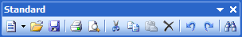
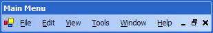
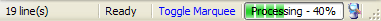

# Overview

There are four main bar control types used throughout Bars:

- Dockable toolbars
- Standalone toolbars
- Popup menus
- Statusbars

Read the following information about each bar control type to understand its use.

## Dockable Toolbars (and Menubars)

Dockable toolbars are managed by a [BarManager](xref:ActiproSoftware.UI.WinForms.Controls.Bars.BarManager) and can be floated or docked to any side of the host container control.  A dockable toolbar is represented by the [DockableToolBar](xref:ActiproSoftware.UI.WinForms.Controls.Bars.DockableToolBar) class.

Dockable toolbars typically have a gripper and an options button.  When in floating mode, the gripper is replaced by a title bar.  When a gripper is clicked on and dragged, the toolbar can be repositioned to be docked to a side of the host container control or to be floated above the host container control.

A menubar is a special type of dockable toolbar and is represented by the [MenuBar](xref:ActiproSoftware.UI.WinForms.Controls.Bars.MenuBar) class.  Only one menubar may be created for a host container control.  The menubar adds additional MDI functionality for displaying system MDI menus and minimize/restore/close buttons of maximized standard MDI windows.

## Standalone Toolbars

Standalone toolbars are separate controls that can be instantiated and used anywhere, even outside of a host container control.  A standalone toolbar is represented by the [ToolBar](xref:ActiproSoftware.UI.WinForms.Controls.Bars.ToolBar) class.

They act similar to a regular Windows Forms `ToolBar` control but have all the advanced features of Bars.  This means that they support the command / command link model, customizable rendering, etc.

Although recommended but not required, they can be attached to a [BarManager](xref:ActiproSoftware.UI.WinForms.Controls.Bars.BarManager).

## Popup Menus

Popup menus are pre-defined menus that are generally used in a contextual situation, where the end-user right-clicks on a control.  A popup menu is represented by the [PopupMenu](xref:ActiproSoftware.UI.WinForms.Controls.Bars.PopupMenu) class.

Do not confuse popup menus with the menus found on a dockable toolbar or menubar.  Those menus are auto-generated based on command and command link settings.  A popup menu is for use in other situations where the menu should appear somewhere in the application that isn't driven by another command link click.  For instance, an ideal spot for a popup menu is to display one in response to a right-click on a textbox editor control in an IDE application.

## Statusbars

Statusbars are standalone controls that work independently of a [BarManager](xref:ActiproSoftware.UI.WinForms.Controls.Bars.BarManager).  A statusbar is represented by the [StatusBar](xref:ActiproSoftware.UI.WinForms.Controls.Bars.StatusBar) class.

They act similar to a regular Windows Forms `StatusBar` control but numerous feature enhancements.  A Bars statusbar supports many customizable properties for controlling the look of each panel.  Panels can show hyperlinks, animated images, progressbars, and more.
