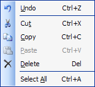

# Popup Menus

Popup menus, represented by the [PopupMenu](xref:@ActiproUIRoot.Controls.Bars.PopupMenu) class, provide pre-defined context menus that can be used in response to events such as right-clicks on controls.



All popup menus should have a unique key and are added to a [BarManager](xref:@ActiproUIRoot.Controls.Bars.BarManager) via the [PopupMenus](xref:@ActiproUIRoot.Controls.Bars.BarManager.PopupMenus) collection.  The popup menu [Key](xref:@ActiproUIRoot.Controls.Bars.PopupMenu.Key) is used as an indexer in that collection.

## Using the Toolbar Style

By default, popup menus display looking like normal menus.  However, they can also optionally display using a toolbar style.

To display them using a toolbar style, set the [UseToolBarStyle](xref:@ActiproUIRoot.Controls.Bars.PopupMenu.UseToolBarStyle) to `true`.  The [ToolBarStyledMenuWrapWidth](xref:@ActiproUIRoot.Controls.Bars.PopupMenu.ToolBarStyledMenuWrapWidth) property controls how wide the menu can become before wrapping command links to the next line.

## Modifying Child Command Links

The [CommandLinks](xref:@ActiproUIRoot.Controls.Bars.PopupMenu.CommandLinks) collection stores all of the command links that are contained by the popup menu.  To programmatically add a new command link to the bar control, simply add it to collection.

## Showing the Popup Menu

There are several overloads of the [Show](xref:@ActiproUIRoot.Controls.Bars.PopupMenu.Show*) method that can be used to display the popup menu.  Whenever an owner control can be specified for the popup menu, it is best to pass that in the appropriate overload.

Some of the overloads show the popup menu at a specific `Point`, either in screen or client coordinates (depending on the overload).

This sample demonstrates how to show a popup menu at the screen coordinate `100, 100`.

```csharp
barManager.PopupMenus["ContextPopupMenu"].Show(new Point(100, 100));
```

The other overloads show the popup menu around a specific `Rectangle` bounds, either in screen or client coordinates (depending on the overload).  These overloads accept parameters indicating from which corner of the `Rectangle` to fly out the popup menu, and at which orientation from that corner.  There also is an offset parameter indicating how far away from the bounds to display the popup menu.

This sample demonstrates how to show a popup menu around the client coordinates of a button.  The popup will show vertically downward from the lower left corner.

```csharp
barManager.PopupMenus["ButtonPopupMenu"].Show(
	button, button.ClientRectangle, Corner.LowerLeft, Orientation.Vertical, 0);
```

## Handling the Command Link Clicks

If the popup menu was retrieved from the [PopupMenus](xref:@ActiproUIRoot.Controls.Bars.BarManager.PopupMenus) collection of the [BarManager](xref:@ActiproUIRoot.Controls.Bars.BarManager), it will already have the [BarManager](xref:@ActiproUIRoot.Controls.Bars.BarManager) reference assigned.  Otherwise, a [BarManager](xref:@ActiproUIRoot.Controls.Bars.BarManager) should be set to the popup menu in its constructor when created.

Once a [BarManager](xref:@ActiproUIRoot.Controls.Bars.BarManager) has been set, the command link clicks can be handled in the [BarManager](xref:@ActiproUIRoot.Controls.Bars.BarManager) events.
