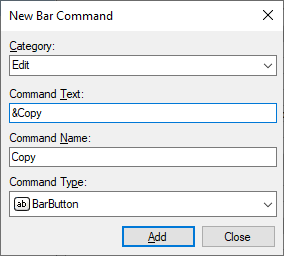

# Designer for .NET Core / .NET 5 and Higher

> [!IMPORTANT]
> This topic is about working with .NET Core or .NET 5 and higher. See the [Designer for .NET Framework](creating-layouts.netfx.md) topic for working with .NET Framework.

The Bars controls are fully customized in a standalone dialog which enables easy interaction with toolbars, menus, and commands.

To get started working with a new bar layout, please follow the steps in this topic.

> [!NOTE]
> See the [Visual Studio Designer](../../visual-studio-designer.md) topic for details and requirements for designer functionality.

## Add a BarManager

Menubars, dockable toolbars, popup menus, and (optionally) standalone toolbars are all managed by a [BarManager](xref:@ActiproUIRoot.Controls.Bars.BarManager).

The first step in creating a bar layout is to add a [BarManager](xref:@ActiproUIRoot.Controls.Bars.BarManager) component to your `Form`.

## Set the HostContainerControl

Before any docking of toolbars can take place, a host container control must be set on the [BarManager](xref:@ActiproUIRoot.Controls.Bars.BarManager).

1. In Visual Studio, select the [BarManager](xref:@ActiproUIRoot.Controls.Bars.BarManager) component.
1. In the **Properties** window, set [HostContainerControl](xref:@ActiproUIRoot.Controls.Bars.BarManager.HostContainerControl) property to the control that should become the host container control. Typically, this is your `Form`.

After a [HostContainerControl](xref:@ActiproUIRoot.Controls.Bars.BarManager.HostContainerControl) has been set, four [BarDockArea](xref:@ActiproUIRoot.Controls.Bars.BarDockArea) controls are added as children of the host container control, one docked to each side.

> [!IMPORTANT]
> The [BarDockArea](xref:@ActiproUIRoot.Controls.Bars.BarDockArea) controls should never be removed manually in the Visual Studio designer.

> [!TIP]
> To change to a different host container control and reparent the dock areas to another control, simply set the [HostContainerControl](xref:@ActiproUIRoot.Controls.Bars.BarManager.HostContainerControl) property to another control. To remove the dock areas completely, set the [HostContainerControl](xref:@ActiproUIRoot.Controls.Bars.BarManager.HostContainerControl) property to `null`.

## Start Customize Mode

To customize [BarManager](xref:@ActiproUIRoot.Controls.Bars.BarManager) in the Visual Studio designer, the design-time customize mode must be started.

To start customize mode:

1. In the Visual Studio designer, right-click on the [BarManager](xref:@ActiproUIRoot.Controls.Bars.BarManager) component to open a context menu.
1. Select **Customize...** from the context menu.

This starts the design-time customize mode and opens the **Customize** dialog. [BarManager](xref:@ActiproUIRoot.Controls.Bars.BarManager) will remain in customize mode until the **Customize** dialog is closed.

## Create Commands

The next step for a new bar layout is to create the commands. All commands require a [Category](xref:@ActiproUIRoot.Controls.Bars.BarCommand.Category) and a Name, and these values are combined to create a unique [FullName](xref:@ActiproUIRoot.Controls.Bars.BarCommand.FullName) for the command. For example, clipboard commands with a category of `"Edit"` might be given a [FullName](xref:@ActiproUIRoot.Controls.Bars.BarCommand.FullName) of `"Edit.Cut"`, `"Edit.Copy"`, and `"Edit.Paste"`.

To create a command:

1. If not already open, start customize mode to open the **Customize** dialog.
1. In the **Customize** dialog, select the **Commands** tab.
1. Click the **New...** button to display the **New Bar Command** dialog.

1. Select an existing **Category** or enter a new category for the command, e.g., *File*, *Edit*, or *View*.
1. Enter the **Command Text** to be displayed in menus and toolbars.
1. Verify the **Command Name**, which is automatically generated from the **Command Text**, or enter a custom value as desired. This value will be combined with given **Category** to create the [FullName](xref:@ActiproUIRoot.Controls.Bars.BarCommand.FullName) of the command.
1. Select the **Command Type** for the new command. See the [Commands Overview](../commands/index.md) topic for more information on different command types.
1. Click **Add** to create the new command. The **New Bar Command** dialog will reset to default values.
1. Repeat the steps above to create any additional commands, then click **Close** to return to the **Customize** dialog.

> [!TIP]
> To get set up quickly, click the **Create Standard** button.  This feature immediately adds several of the most common commands to the [BarManager](xref:@ActiproUIRoot.Controls.Bars.BarManager) and is a real time-saver for most applications.

## Create Bar Controls

With commands defined, bar controls are ready to be created and populated with command links. The **Customize** dialog can be used to create menubars, dockable toolbars, and popup menus.

### Create a MenuBar

To create a [MenuBar](xref:@ActiproUIRoot.Controls.Bars.MenuBar):

1. If not already open, start customize mode to open the **Customize** dialog.
1. Select the **Toolbars & Menus** tab.
1. Click the **New...** button to display the **New Bar Control** dialog.
1. Enter a **Name** for the new control, e.g., *Main Menu*.
1. Select [MenuBar](xref:@ActiproUIRoot.Controls.Bars.MenuBar) for the **Bar control type**.
1. Click **OK**.

The menubar should now be visible in the designer, but it has no command links in it.

> [!TIP]
> If the [MenuBar](xref:@ActiproUIRoot.Controls.Bars.MenuBar) control type is disabled on the **New Bar Control** dialog, make sure the [BarManager](xref:@ActiproUIRoot.Controls.Bars.BarManager).[HostContainerControl](xref:@ActiproUIRoot.Controls.Bars.BarManager.HostContainerControl) property has been assigned. This option will also be disabled if a [MenuBar](xref:@ActiproUIRoot.Controls.Bars.MenuBar) has already been added to the [BarManager](xref:@ActiproUIRoot.Controls.Bars.BarManager).

### Create a DockableToolBar

To create a [DockableToolBar](xref:@ActiproUIRoot.Controls.Bars.DockableToolBar):

1. If not already open, start customize mode to open the **Customize** dialog.
1. Select the **Toolbars & Menus** tab.
1. Click the **New...** button to display the **New Bar Control** dialog.
1. Enter a **Name** for the new control, e.g., *Standard*.
1. Select [DockableToolBar](xref:@ActiproUIRoot.Controls.Bars.DockableToolBar) for the **Bar control type**.
1. Click **OK**.

The toolbar should now be visible in the designer, but it has no command links in it.

### Create a PopupMenu

To create a [PopupMenu](xref:@ActiproUIRoot.Controls.Bars.PopupMenu):

1. If not already open, start customize mode to open the **Customize** dialog.
1. Select the **Toolbars & Menus** tab.
1. Click the **New...** button to display the **New Bar Control** dialog.
1. Enter a **Name** for the new control, e.g., *Popup*.
1. Select [PopupMenu](xref:@ActiproUIRoot.Controls.Bars.PopupMenu) for the **Bar control type**.
1. Click **OK**.

A popup menu will not be visible in the designer.

## Add Command Links to Bar Controls

To add command links to a bar control, the desired bar control must first be selected:

1. If not already open, start customize mode to open the **Customize** dialog.
1. Select the **Links** tab.
1. Select the **Menu bar**, **Dockable toolbar**, **Popup menu**, or **Stand-alone toolbar** radio button which corresponds to the type of bar control to be customized.
1. Select the bar control from the corresponding drop-down list.
1. The **Preview** list will display the command links for the selected bar control.

> [!TIP]
> When a bar control is selected on the **Toolbars & Menus** tab, either click the **Show Links** button or double-click the bar control in the list to jump to the **Links** tab with the same bar control pre-selected.

To add command links to bar controls:

1. Click the **Add Command...** button to open the **Add Command** dialog.
1. Select a command in the **Commands** list.
1. Click **OK** to create a link to the selected command and close the **Add Command** dialog.
1. Repeat the above steps the add additional command links, as necessary.

> [!TIP]
> If you chose to create the standard commands in the Create Commands step, the bar control can be easily set up by clicking the **Add Standard** button. The commands added will vary based on the type of bar control.

The command link provides a user interface instance for the command that was dragged. See the [Commands and Command Links Overview](../commands/index.md) topic for more information on the distinction between commands and command links.

New command links are added after any command link already selected in the **Preview** list or will be added at the end if there is no selection. Click the **Move Up** and **Move Down** buttons, as needed, to change the position of a selected command link after if it inserted.

## Customize Command Links

The **Links** tab of the **Customize** dialog is used to customize all command links. Every bar control has a collection of command links, and popup command links (e.g., [BarPopupButtonLink](xref:@ActiproUIRoot.Controls.Bars.BarPopupButtonLink) or [BarSplitButtonLink](xref:@ActiproUIRoot.Controls.Bars.BarSplitButtonLink)) also have their own child links.

The top section of the **Links** tab is used to select which collection of links will be customized, where each bar control type has its own drop-down of selections. For each drop-down, bar controls are listed by name. Child popup links are listed by their hierarchy with a vertical bar (`|`) separating the name of a parent from the name of a child. Since there is only one menubar allowed, the primary links on a menubar will omit the parent menubar identifier when displayed in the drop-down list.

For example, a **New** popup link on a dockable toolbar named "Standard" will be displayed as **Standard | New**. The same **New** popup link under the **File** menu of a menubar will be listed as **File | New** instead of **MenuBar | File | New**.

To customize a command link:

1. If not already open, start customize mode to open the **Customize** dialog.
1. Select the **Links** tab.
1. Select the **Menu bar**, **Dockable toolbar**, **Popup menu**, or **Stand-alone toolbar** radio button which corresponds to the type of bar control to be customized.
1. Select the bar control or popup link from the corresponding drop-down list.
1. In the **Preview** list, select the command link to be customized.
1. Use the **Properties** grid or available command buttons to modify the properties of the command link.

> [!TIP]
>
> - Click the **Show Links** button to quickly customize the child links of the selected command link (for popup command links).
> - Click the **Show Command** button to jump to the command on the **Commands** tab which owns the selected command link.
> - Double-clicking a command link in the **Preview** list will perform the **Show Links** action for popup command links, otherwise the **Show Command** action is performed.

## Save Backup Layout

> [!IMPORTANT]
> Since the Visual Studio designer has been known to be buggy (with or without Actipro controls), saving a layout to a file is strongly encouraged!

Many hours can be spent building complex layouts, so exporting a layout can help recover that effort in the event of designer serialization problem or even accidental changes.

To save a backup of the layout:

1. If it is open, close the **Customize** dialog to stop the design-time customize mode and ensure all changes have been committed.
1. In the Visual Studio designer, right-click on the [BarManager](xref:@ActiproUIRoot.Controls.Bars.BarManager) component to open a context menu.
1. Select **Save Layout to File...**.
1. When prompted, select an XML file where the layout will be saved.

The complete layout stores all data about the commands, managed bar controls, and command links. This file can be used with the **Load Layout from File...** designer action to completely restore the layout.
