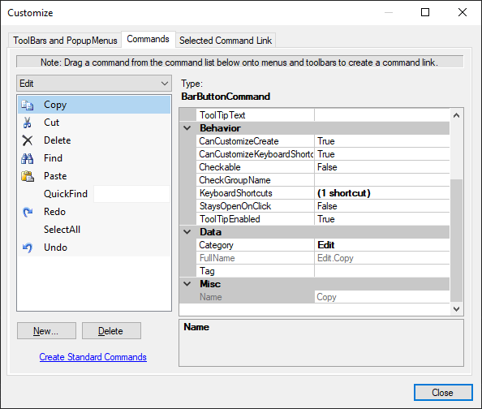
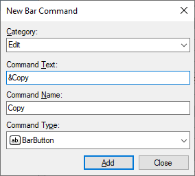
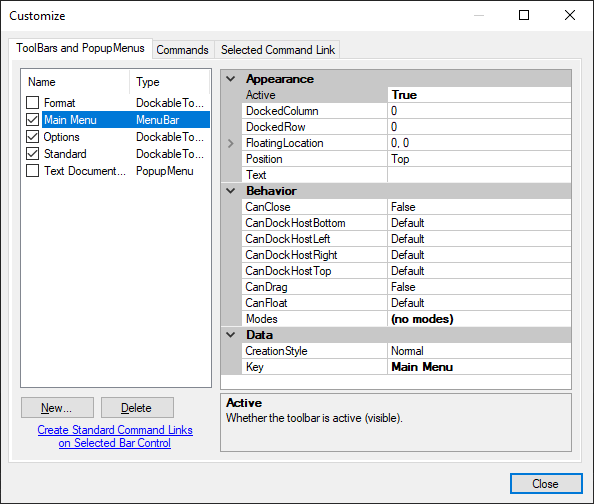
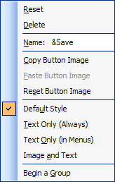
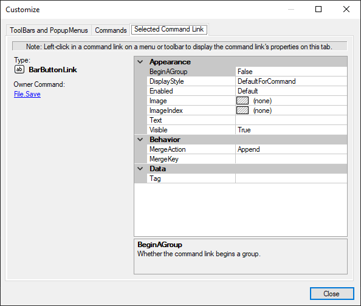

# Designer for .NET Framework

> [!IMPORTANT]
> This topic is about working with .NET Framework. See the [Designer for .NET Core / .NET 5 and Higher](creating-layouts.md) topic for working with .NET Core or .NET 5 and higher.

The Bars controls are specifically designed to make the design-time customization experience remarkably like the run-time customization experience. The Bars controls can be completely designed and customized in the designer and rely heavily on drag-and-drop functionality.

To get started working with a new bar layout, please follow the steps in this topic.

> [!NOTE]
> See the [Visual Studio Designer](../../visual-studio-designer.md) topic for details and requirements for designer functionality.

## Add a BarManager

Menubars, dockable toolbars, popup menus, and (optionally) standalone toolbars are all managed by a [BarManager](xref:@ActiproUIRoot.Controls.Bars.BarManager).

The first step in creating a bar layout is to add a [BarManager](xref:@ActiproUIRoot.Controls.Bars.BarManager) component to your `Form`.

## Set the HostContainerControl

Before any docking of toolbars can take place, a host container control must be set on the [BarManager](xref:@ActiproUIRoot.Controls.Bars.BarManager).

1. In Visual Studio, select the [BarManager](xref:@ActiproUIRoot.Controls.Bars.BarManager) component.
1. In the **Properties** window, set [HostContainerControl](xref:@ActiproUIRoot.Controls.Bars.BarManager.HostContainerControl) property to the control that should become the host container control. Typically, this is your `Form`.

After a [HostContainerControl](xref:@ActiproUIRoot.Controls.Bars.BarManager.HostContainerControl) has been set, four [BarDockArea](xref:@ActiproUIRoot.Controls.Bars.BarDockArea) controls are added as children of the host container control, one docked to each side.

> [!IMPORTANT]
> The [BarDockArea](xref:@ActiproUIRoot.Controls.Bars.BarDockArea) controls should never be removed manually in the Visual Studio designer.

> [!TIP]
> To change to a different host container control and reparent the dock areas to another control, simply set the [HostContainerControl](xref:@ActiproUIRoot.Controls.Bars.BarManager.HostContainerControl) property to another control. To remove the dock areas completely, set the [HostContainerControl](xref:@ActiproUIRoot.Controls.Bars.BarManager.HostContainerControl) property to `null`.

## Start Customize Mode

To customize [BarManager](xref:@ActiproUIRoot.Controls.Bars.BarManager) in the Visual Studio designer, the design-time customize mode must be started.

To start customize mode:

1. In the Visual Studio designer, right-click on the [BarManager](xref:@ActiproUIRoot.Controls.Bars.BarManager) component to open a context menu.
1. Select **Customize...** from the context menu.

This starts the design-time customize mode and opens the **Customize** dialog. [BarManager](xref:@ActiproUIRoot.Controls.Bars.BarManager) will remain in customize mode until the **Customize** dialog is closed.

## Create Commands

The next step for a new bar layout is to create the commands. All commands require a [Category](xref:@ActiproUIRoot.Controls.Bars.BarCommand.Category) and a Name, and these values are combined to create a unique [FullName](xref:@ActiproUIRoot.Controls.Bars.BarCommand.FullName) for the command. For example, clipboard commands with a category of `"Edit"` might be given a [FullName](xref:@ActiproUIRoot.Controls.Bars.BarCommand.FullName) of `"Edit.Cut"`, `"Edit.Copy"`, and `"Edit.Paste"`.

To create a command:

1. If not already open, start customize mode to open the **Customize** dialog.
1. In the **Customize** dialog, select the **Commands** tab.
1. Click the **New...** button to display the **New Bar Command** dialog.

1. Select an existing **Category** or enter a new category for the command, e.g., *File*, *Edit*, or *View*.
1. Enter the **Command Text** to be displayed in menus and toolbars.
1. Verify the **Command Name**, which is automatically generated from the **Command Text**, or enter a custom value as desired. This value will be combined with given **Category** to create the [FullName](xref:@ActiproUIRoot.Controls.Bars.BarCommand.FullName) of the command.
1. Select the **Command Type** for the new command. See the [Commands Overview](../commands/index.md) topic for more information on different command types.
1. Click **Add** to create the new command. The **New Bar Command** dialog will reset to default values.
1. Repeat the steps above to create any additional commands, then click **Close** to return to the **Customize** dialog.

> [!TIP]
> To get set up quickly, click the **Create Standard Commands** link.  This feature immediately adds several of the most common commands to the [BarManager](xref:@ActiproUIRoot.Controls.Bars.BarManager) and is a real time-saver for most applications.

## Create Bar Controls

With commands defined, bar controls are ready to be created and populated with command links. The **Customize** dialog can be used to create menubars, dockable toolbars, and popup menus.

### Create a MenuBar

To create a [MenuBar](xref:@ActiproUIRoot.Controls.Bars.MenuBar):

1. If not already open, start customize mode to open the **Customize** dialog.
1. Select the **ToolBars and PopupMenus** tab.
1. Click the **New...** button to display the **New Bar Control** dialog.
1. Enter a **Name** for the new control, e.g., *Main Menu*.
1. Select [MenuBar](xref:@ActiproUIRoot.Controls.Bars.MenuBar) for the **Bar control type**.
1. Click **OK**.

The menubar should now be visible in the designer, but it has no command links in it.

> [!NOTE]
> If the [MenuBar](xref:@ActiproUIRoot.Controls.Bars.MenuBar) control type is disabled on the **New Bar Control** dialog, make sure the [BarManager](xref:@ActiproUIRoot.Controls.Bars.BarManager).[HostContainerControl](xref:@ActiproUIRoot.Controls.Bars.BarManager.HostContainerControl) property has been assigned. This option will also be disabled if a [MenuBar](xref:@ActiproUIRoot.Controls.Bars.MenuBar) has already been added to the [BarManager](xref:@ActiproUIRoot.Controls.Bars.BarManager).

> [!TIP]
> If you chose to create the standard commands in the Create Commands step, the menubar can be easily set up by clicking the **Create Standard Command Links on Selected Bar Control** link.  Several common menus and child menu items are created by this feature which are appropriate for a [MenuBar](xref:@ActiproUIRoot.Controls.Bars.MenuBar).

### Create a DockableToolBar

To create a [DockableToolBar](xref:@ActiproUIRoot.Controls.Bars.DockableToolBar):

1. If not already open, start customize mode to open the **Customize** dialog.
1. Select the **ToolBars and PopupMenus** tab.
1. Click the **New...** button to display the **New Bar Control** dialog.
1. Enter a **Name** for the new control, e.g., *Standard*.
1. Select [DockableToolBar](xref:@ActiproUIRoot.Controls.Bars.DockableToolBar) for the **Bar control type**.
1. Click **OK**.

The toolbar should now be visible in the designer, but it has no command links in it.

> [!TIP]
> If you chose to create the standard commands in the Create Commands step, the toolbar can be easily set up by clicking the **Create Standard Command Links on Selected Bar Control** link.  Several common buttons are created by this feature which are appropriate for a toolbar.

### Create a PopupMenu

To create a [PopupMenu](xref:@ActiproUIRoot.Controls.Bars.PopupMenu):

1. If not already open, start customize mode to open the **Customize** dialog.
1. Select the **ToolBars and PopupMenus** tab.
1. Click the **New...** button to display the **New Bar Control** dialog.
1. Enter a **Name** for the new control, e.g., *Popup*.
1. Select [PopupMenu](xref:@ActiproUIRoot.Controls.Bars.PopupMenu) for the **Bar control type**.
1. Click **OK**.

The menu will not be visible in the designer by default. On the **ToolBars and PopupMenus** tab of the **Customize** dialog, locate the new [PopupMenu](xref:@ActiproUIRoot.Controls.Bars.PopupMenu) in the list of bar controls and check the box next to its name. The **PopupMenu Designer** will be shown for the menu, but it has no command links in it.

> [!TIP]
> If you chose to create the standard commands in the Create Commands step, the [PopupMenu](xref:@ActiproUIRoot.Controls.Bars.PopupMenu) can be easily set up by clicking the **Create Standard Command Links on Selected Bar Control** link.  Several common buttons are created by this feature which are appropriate for a [PopupMenu](xref:@ActiproUIRoot.Controls.Bars.PopupMenu).

## Add Command Links to Bar Controls

To add command links to bar controls:

1. If not already open, start customize mode to open the **Customize** dialog.
1. Select the **ToolBars and PopupMenus** tab.
1. Locate the bar control in the list and ensure it is visible by checking the box next to its name.
1. Select the **Commands** tab.
1. Click any **Command** in the **Commands List** and drag it to the desired location on bar control, verify the location shown by the **Drop Indicator**, then drop the command to create a link at that location.
1. Continue to drag-and-drop commands to create other command links, as necessary.

The command link provides a user interface instance for the command that was dragged. See the [Commands and Command Links Overview](../commands/index.md) topic for more information on the distinction between commands and command links.

## Customize Command Links

There are two primary methods used to customize a command link.

- The **Customize Context Menu** provides quick access to common customizations.
- The **Customize** dialog provides full customization.

### Customize Context Menu

To customize a command link using the **Customize Context Menu**:

1. If not already started, start customize mode. This will open the **Customize** dialog, but it will not be used for this customization technique.
1. Right-click on a command link to open the **Customize Context Menu**.
1. Interact with one or more of the commands on the context menu to customize the command link.

The **Customize Context Menu** makes it easy to toggle if a command link begins a group, change the display style, and other common customizations.

### Customize Dialog

To fully customize a command link using the **Customize** dialog:

1. If not already open, start customize mode to open the **Customize** dialog.
1. Select the **Selected Command Link** tab.
1. In the designer, click any command link. The **Properties** grid will display the properties of the selected command link.
1. Use the **Properties** grid to modify the properties of the command link.

> [!TIP]
> Click the **Owner Command** link to jump to the command on the **Commands** tab which owns the selected command link.

## Save Backup Layout

> [!IMPORTANT]
> Since the Visual Studio designer has been known to be buggy (with or without Actipro controls), saving a layout to a file is strongly encouraged!

Many hours can be spent building complex layouts, so exporting a layout can help recover that effort in the event of designer serialization problem or even accidental changes.

To save a backup of the layout:

1. If it is open, close the **Customize** dialog to stop the design-time customize mode and ensure all changes have been committed.
1. In the Visual Studio designer, right-click on the [BarManager](xref:@ActiproUIRoot.Controls.Bars.BarManager) component to open a context menu.
1. Select **Save Layout to File...**.
1. When prompted, select an XML file where the layout will be saved.

The complete layout stores all data about the commands, managed bar controls, and command links. This file can be used with the **Load Layout from File...** designer action to completely restore the layout.
