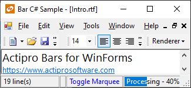

# Extensible Rendering

All the bar controls use an extensible rendering model that is based on our common object model.  The object model centers around the use of a renderer class.  The renderer measures and draws all of the elements within the control.  This is a great design because it allows you to use our pre-defined renderers or create your own.

This object model allows for three levels of rendering customization.  Choose which level of customization you wish to use:

- Use Built-In Renderers As-Is - Use the built-in rendering styles without any changes, which include all Visual Studio and Office styles.
- Modify Properties on Built-In Renderers - Use the built-in renderers but modify the various properties on the renderers to easily create a customized appearance.
- Create Custom Renderers - Implement the [IBarRenderer](xref:ActiproSoftware.UI.WinForms.Controls.Bars.IBarRenderer) or [IStatusBarRenderer](xref:ActiproSoftware.UI.WinForms.Controls.Bars.IStatusBarRenderer) interfaces or inherit our [BarRenderer](xref:ActiproSoftware.UI.WinForms.Controls.Bars.BarRenderer) or [StatusBarRenderer](xref:ActiproSoftware.UI.WinForms.Controls.Bars.StatusBarRenderer) classes to do all the measuring and drawing of the controls and their elements yourself.

These are some sample rendering styles that come with [BarManager](xref:ActiproSoftware.UI.WinForms.Controls.Bars.BarManager) and [StatusBar](xref:ActiproSoftware.UI.WinForms.Controls.Bars.StatusBar):



## Use Built-In Renderers As-Is

Bars includes these built-in renderers, which support Metro Light, Office 2007/2003, and Visual Studio 2005/2002 styles:

| Renderer | Description |
|-----|-----|
| [MetroLightBarRenderer](xref:ActiproSoftware.UI.WinForms.Controls.Bars.MetroLightBarRenderer) | Capable of drawing Metro Light bar controls. |
| [Office2003BarRenderer](xref:ActiproSoftware.UI.WinForms.Controls.Bars.Office2003BarRenderer) | Capable of drawing all Office 2007 styles (Blue, Silver, Black), Office 2003 styles (Blue, Olive, Silver, Royale, and Windows Classic), as well as the Visual Studio 2005 style for bar controls.  To change to a different style, change the [BaseColorSchemeType](xref:ActiproSoftware.UI.WinForms.Controls.Bars.Office2003BarRenderer.BaseColorSchemeType). |
| [Office2003StatusBarRenderer](xref:ActiproSoftware.UI.WinForms.Controls.Bars.Office2003StatusBarRenderer) | Capable of drawing all Office styles for statusbar controls. |
| [VisualStudio2002BarRenderer](xref:ActiproSoftware.UI.WinForms.Controls.Bars.VisualStudio2002BarRenderer) | Capable of drawing Visual Studio 2002 bar controls. |
| [VisualStudio2002StatusBarRenderer](xref:ActiproSoftware.UI.WinForms.Controls.Bars.VisualStudio2002StatusBarRenderer) | Capable of drawing Visual Studio 2002 statusbar controls. |
| [VisualStudio2005StatusBarRenderer](xref:ActiproSoftware.UI.WinForms.Controls.Bars.VisualStudio2005StatusBarRenderer) | Capable of drawing Visual Studio 2005 statusbar controls. |

## Color Tinting Color Schemes

With one line of code, any `WindowsColorScheme` can be tinted so that all of the colors are altered.  For instance, you can easily create a tan or red color scheme and then use those color schemes with the [Office2003BarRenderer](xref:ActiproSoftware.UI.WinForms.Controls.Bars.Office2003BarRenderer) class like this:


This code shows how to load a custom tan-tinted color scheme (displayed in the screenshot above) that is based on the built-in Windows XP blue theme:

```csharp
WindowsColorScheme scheme = new WindowsColorScheme("Tan", WindowsColorSchemeType.WindowsXPBlue, Color.Tan);
barManager.Renderer = new Office2003BarRenderer(scheme);
```

## Customizing Specific Colors in a Color Scheme

Each color property on the `WindowsColorScheme` class has a getter and setter.  This means that after a base color scheme is selected for use, you may alter specific colors as needed.

This code shows how change the background of menus to be `LightBlue` for the built-in Windows Classic color scheme.

```csharp
WindowsColorScheme.WindowsClassic.MenuBack = Color.LightBlue;
```

> [!NOTE]
> Any renderers created before the color settings were changed may need to be refreshed for the color changes to take effect in the renderer.

## Modify Properties on Built-In Renderers

Select a base built-in renderer to use by following the steps above.  Then use the designer to change its properties.  You can change fonts, colors, backgrounds, measuring parameters, etc.  Our built-in renderers give you a lot of options that you can use to customize the look and feel of the controls.

## Create Custom Renderers

For the most flexibility over what is measured and rendered, create a class that implements the [IBarRenderer](xref:ActiproSoftware.UI.WinForms.Controls.Bars.IBarRenderer) or [IStatusBarRenderer](xref:ActiproSoftware.UI.WinForms.Controls.Bars.IStatusBarRenderer) interfaces.  Alternatively, you can create a class that inherits our [BarRenderer](xref:ActiproSoftware.UI.WinForms.Controls.Bars.BarRenderer) or [StatusBarRenderer](xref:ActiproSoftware.UI.WinForms.Controls.Bars.StatusBarRenderer), or one of their descendants.  The renderer interface has methods that measure and draw the controls and their elements.

After your custom renderer class has been created, assign it to the [Renderer](xref:ActiproSoftware.UI.WinForms.Controls.Bars.BarManager.Renderer) property of each [BarManager](xref:ActiproSoftware.UI.WinForms.Controls.Bars.BarManager), or the [Renderer](xref:ActiproSoftware.UI.WinForms.Controls.Bars.StatusBar.Renderer) property of each [StatusBar](xref:ActiproSoftware.UI.WinForms.Controls.Bars.StatusBar) that should use it for drawing.

## Customizing Individual Statusbar Panels

Renderer settings affect the rendering of all the controls that use the renderer.  However there are other properties on each [StatusBarPanel](xref:ActiproSoftware.UI.WinForms.Controls.Bars.StatusBarPanel) that allow for customization of that particular instance.  These are the properties that can be used to customize a specific panel:

| Member | Description |
|-----|-----|
| [BackgroundFill](xref:ActiproSoftware.UI.WinForms.Controls.Bars.StatusBarPanel.BackgroundFill) Property | Gets or sets the page-specific `BackgroundFill` for the panel. |
| [Border](xref:ActiproSoftware.UI.WinForms.Controls.Bars.StatusBarPanel.Border) Property | Gets or sets the page-specific `SimpleBorder` for the panel. |
