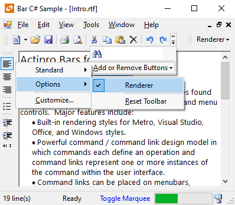

# Overview

Actipro Bars contains our advanced bar controls which mimic bar control functionality found in applications such as Office and Visual Studio.  The control sets include [docking toolbars](controls/dockable-toolbars.md), [standalone toolbars](controls/standalone-toolbars.md), [popup menus](controls/popup-menus.md), and [statusbars](controls/status-bars.md).

Actipro has tried to differentiate its product from other competitors by offering several different approaches in its implementation than what competitors typically provide.  The major difference is that the bar controls are based entirely on a [command / command link](commands/index.md) design pattern.  This makes it easy to make centralized updates to a command that filters through to every instance of a related command link in the user interface.  This also enables Bars to support complete [run-time customization](run-time-customization.md) by the end-user, similar to the features found in Office or Visual Studio.

[Keyboard shortcuts](keyboard-shortcuts.md) have all the features found in Visual Studio, such as single-key shortcuts, chord shortcuts (two-key sequences), the ability to be recognized only in certain [application modes](application-modes.md), and more.  Bars also can automatically show or hide certain dockable toolbars based on which application mode is set.

The bar controls have [designer support](designer/index.md) which lets you design and manipulate the bar controls in the designer, and then serialize the layout to code for when the application is executed in run-time mode.

[Bar layouts](layouts.md) can be serialized to a file or stream and later reloaded to restore all the same layout and customization states.

Out of the box, the bar controls have [rendering capabilities](extensible-rendering.md) that mimic Visual Studio, Office, and Windows styles.

*Bar controls in the Metro Light theme*

## Feature List

- Built-in [rendering styles](extensible-rendering.md) include Metro, Visual Studio, Office, and Windows Classic styles.

- Robust rendering interface allows for totally customized rendering.

- Powerful [command / command link](commands/index.md) design model in which commands each define an operation and command links represent one or more instances of the command within the user interface.

- Command types include [normal buttons](commands/buttons.md), [popup buttons](commands/popupbuttons.md), [expander buttons](commands/expander-buttons.md), [split buttons](commands/splitbuttons.md), [labels](commands/labels.md), [textboxes](commands/textboxes.md), and [comboboxes](commands/comboboxes.md).

- Normal and split buttons can be checkable.

- [Checkable buttons](checkable-buttons.md) can be placed in check groups.

- Options for automatically toggling the checked state of checkable buttons when they are clicked and unchecking any other checkable buttons in the same check group.

- Ability to create default command links for popup or split button commands.

- Command links can be placed on menubars, toolbars or menus.

- Tooltips for command links.

- Dockable toolbars and menubars support docking on all sides of their host container, as well as floating mode.

- Instance properties and global overrides such as `CanDockHostLeft`, `CanClose`, etc. give precise control over dockable toolbar capabilities.

- Ability for dockable toolbars to auto-show/hide based on what [application mode](application-modes.md) is set.

- Overflow and flow dockable toolbar layout modes.

- Reset dockable toolbar functionality and Add/Remove Buttons functionality.

- Tear-off menus.

- Toolbar display style for popup menus.

- Clicks on toolbars and menus don't steal focus from tool windows.

- Save/load complete command and command link configurations to [XML layout files](layouts.md) for backup of designer layouts.

- Save/load differential command and command link configurations to [XML layout files](layouts.md) (used at run-time to store changes between the designed bar layout and the end-user customizations).

- Bar control merge and revert merge makes supporting [MDI situations](working-with-mdi.md) easier.

- Stand-alone toolbars.

- Statusbar control that supports panels with links, animated images, progressbars, and more.

- Extremely advanced [keyboard shortcut](keyboard-shortcuts.md) processing that supports application modes, chords (two-key sequences), and more.

- Multiple keyboard shortcuts may be assigned for each command.

- Event is raised when keyboard shortcuts are pressed, allowing for the updating of a statusbar.

- [ClipboardChanged event](clipboard-change-notification.md) that is raised whenever the contents of the clipboard change, allowing for the updating of an `Edit.Paste` command's enabled state.

- Control over which MDI child buttons are displayed when in standard MDI mode and an MDI child window is maximized.

- Popup menus with a design-time popup menu designer.

- Command / command link design model allows for total run-time UI customization, just like in Office or Visual Studio.

- Quick customize mode of menubar and toolbar command links (via holding down of <kbd>Alt</kbd> key).

- A `CommandUpdate` event that is raised periodically allowing for the command states in the user interface to be updated lazily.

- Complete source code supplied for a fully-functional run-time **Customize** dialog familiar to users of Microsoft products.

- `BarCommandListBox` control that lists commands and allows for run-time customization when used on a **Customize** dialog.

- `BarKeyboardShortcutTextBox` that allows for the definition of keyboard shortcuts, including shortcuts that consist of chords.

- Detailed event model.

- Full [designer support](designer/index.md) for codeless layout design.
