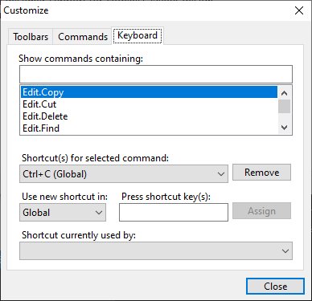

# Keyboard Shortcuts

Another great feature of the bar controls is their handling of keyboard shortcuts.  Bars' keyboard shortcuts support all the functionality found in Visual Studio, which includes single key shortcuts, chord shortcuts (two keys pressed in sequence), shortcuts that are only applicable in certain application modes, shortcuts that are applicable in any application mode, and disabled shortcuts.



## Keyboard Shortcut Basics

Keyboard shortcuts are represented by the [BarKeyboardShortcut](xref:@ActiproUIRoot.Controls.Bars.BarKeyboardShortcut) class, which has these important instance members:

| Member | Description |
|-----|-----|
| [ChordKey](xref:@ActiproUIRoot.Controls.Bars.BarKeyboardShortcut.ChordKey) Property | Gets the `Keys` that starts the chord.  This property is set via the constructor. |
| [Description](xref:@ActiproUIRoot.Controls.Bars.BarKeyboardShortcut.Description) Property | Gets the user-friendly description of the shortcut (keys and mode). |
| [Enabled](xref:@ActiproUIRoot.Controls.Bars.BarKeyboardShortcut.Enabled) Property | Gets or sets whether the shortcut is enabled. |
| [Key](xref:@ActiproUIRoot.Controls.Bars.BarKeyboardShortcut.Key) Property | Gets the `Keys` that is the main shortcut key.  This property is set via the constructor. |
| [Mode](xref:@ActiproUIRoot.Controls.Bars.BarKeyboardShortcut.Mode) Property | Gets the mode in which the shortcut is valid.  This property is set via the constructor. |
| [ToString](xref:@ActiproUIRoot.Controls.Bars.BarKeyboardShortcut.ToString*) Method | Converts the object to a `String` that has a user-friendly key name (for a single key shortcut) or a user-friendly chord key sequence (for a chord shortcut). |

The static helper method [BarKeyboardShortcut](xref:@ActiproUIRoot.Controls.Bars.BarKeyboardShortcut).[GetKeyString](xref:@ActiproUIRoot.Controls.Bars.BarKeyboardShortcut.GetKeyString*) converts a `Keys` to a user-friendly description.

## Chords

Chords are keyboard shortcuts that use a two-key sequence in order to be recognized.  This concept has been a popular feature in Visual Studio.  For instance, in Visual Studio, the key sequence `Ctrl+K, Ctrl+K` sets a bookmark and `Ctrl+K, Ctrl+L` clears all bookmarks.  Bars functions the same way as Visual Studio.

If a keyboard shortcut should not be a chord, set its [ChordKey](xref:@ActiproUIRoot.Controls.Bars.BarKeyboardShortcut.ChordKey) property to `Keys.None`.

## Modes

Keyboard shortcuts can optionally be set up to work only in a certain application mode.  For more information on application modes, see the [Application Modes](application-modes.md) topic.

Each [BarKeyboardShortcut](xref:@ActiproUIRoot.Controls.Bars.BarKeyboardShortcut) has a [Mode](xref:@ActiproUIRoot.Controls.Bars.BarKeyboardShortcut.Mode) property.  If that value is `null`, then the shortcut applies to the global mode.  If that value is populated, then the shortcut only applies to that specific mode.

For example, if a `"Text Editor"` mode is currently set, any keyboard shortcuts defined for the `"Text Editor"` mode will be recognized.  If there is no keyboard shortcut defined in the mode for a key sequence that is pressed, a keyboard shortcut in the global mode is searched for.  If one is found, then that keyboard shortcut is used.

## Assigning Keyboard Shortcuts to a Command

Each command supports zero or more keyboard shortcuts.  To add a keyboard shortcut to a command, simply add it to the command's [KeyboardShortcuts](xref:@ActiproUIRoot.Controls.Bars.BarCommand.KeyboardShortcuts) collection.

Only certain commands respond to keyboard shortcuts.  For instance, regular buttons and split buttons will raise the [CommandClick](xref:@ActiproUIRoot.Controls.Bars.BarManager.CommandClick) event when their shortcuts are pressed.  Custom controls typically receive focus when their shortcuts are pressed.

## Displaying Keyboard Shortcuts in Tooltips

By default, keyboard shortcuts are displayed in tooltips.  Set the [KeyboardShortcutsVisibleInToolTips](xref:@ActiproUIRoot.Controls.Bars.BarManager.KeyboardShortcutsVisibleInToolTips) property to `false` to disable this behavior.

## The KeyTyped Event

The [KeyTyped](xref:@ActiproUIRoot.Controls.Bars.BarManager.KeyTyped) event is raised whenever a keyboard shortcut is recognized or, for a chord, is in the process of being recognized.  This is useful for programmatically cancelling a keyboard shortcut or for updating a status bar panel when a chord is not recognized or is waiting for the second shortcut of the chord.

This code demonstrates how to interpret the four situations that occur when the event is raised:

```csharp
/// <summary>
/// Occurs when a possible shortcut key is typed.
/// </summary>
/// <param name="sender">Sender of the event.</param>
/// <param name="e">Event arguments.</param>
private void barManager_KeyTyped(object sender, ActiproSoftware.UI.WinForms.Controls.Bars.BarKeyTypedEventArgs e) {
	if (e.ChordKey != Keys.None) {
		if (e.Key != Keys.None) {
			if (e.Command != null) {
				// A full chord sequence is recognized and the specified command will execute
			}
			else {
				// A full chord sequence was typed but is not recognized
			}
		}
		else {
			// A chord sequence has been started
		}
	}
	else {
		// A single key is recognized and the specified command will execute
	}
}
```

## Disabled Shortcuts

Sometimes it is handy to be able to disable a shortcut.  This can be done by setting the [Enabled](xref:@ActiproUIRoot.Controls.Bars.BarKeyboardShortcut.Enabled) property to `false`.  When a shortcut is disabled, it does not execute its associated [BarCommand](xref:@ActiproUIRoot.Controls.Bars.BarCommand).

This is extremely useful for commands such as `"Edit.Cut"`.  For that command, you want the default system shortcut <kbd>Ctrl</kbd>+<kbd>X</kbd> to display for the command link when on a menu, but you don't really want the [BarManager](xref:@ActiproUIRoot.Controls.Bars.BarManager) to intercept the <kbd>Ctrl</kbd>+<kbd>X</kbd> key since that would potentially block controls from being able to access cut functionality unless you specifically coded this for every `Control` on your `Form`.  Therefore, disable the keyboard shortcut.  It can still be added to a command and will display in the user interface but will not be handled when the key sequence is pressed.

## Protected Keys and Keyboard Shortcuts

You may wish to protect certain keys or keyboard shortcuts, which means that they cannot be added or removed as a keyboard shortcut.  All disabled shortcuts are automatically protected.

In the above example, this means that <kbd>Ctrl</kbd>+<kbd>X</kbd> cannot be used as a single-key shortcut and also cannot be used as a chord start by any other command.  Also, <kbd>Ctrl</kbd>+<kbd>X</kbd> cannot be removed from the `"Edit.Cut"` command.

Specific keys, such as <kbd>Esc</kbd>, can be temporarily protected by adding them to the [ProtectedKeys](xref:@ActiproUIRoot.Controls.Bars.BarManager.ProtectedKeys) collection on the [BarManager](xref:@ActiproUIRoot.Controls.Bars.BarManager).
