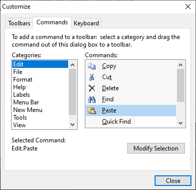

# Run-Time Customization

One of the best features of the Bars controls is the ability to support complete run-time customization by the end-user with capabilities rivaling those in Office and Visual Studio.  Since the actual use of run-time customization is well-known by users familiar with those products, this topic will focus on how to implement customization using the Bars product.

## Starting and Stopping Customization

The [CustomizeMode](xref:ActiproSoftware.UI.WinForms.Controls.Bars.BarManager.CustomizeMode) property on the [BarManager](xref:ActiproSoftware.UI.WinForms.Controls.Bars.BarManager) controls the current customization mode.  This value is of type [BarCustomizeMode](xref:ActiproSoftware.UI.WinForms.Controls.Bars.BarCustomizeMode) and has these values:

| Value | Description |
|-----|-----|
| [None](xref:ActiproSoftware.UI.WinForms.Controls.Bars.BarCustomizeMode.None) | There is no customize mode active. |
| [QuickCustomize](xref:ActiproSoftware.UI.WinForms.Controls.Bars.BarCustomizeMode.QuickCustomize) | The quick customize mode is active.  This occurs when the `Alt` key is held down at run-time. |
| [DialogCustomize](xref:ActiproSoftware.UI.WinForms.Controls.Bars.BarCustomizeMode.DialogCustomize) | The dialog customize mode is active.  A run-time customize mode should be displayed while this mode is active. |

> [!IMPORTANT]
> The [CustomizeMode](xref:ActiproSoftware.UI.WinForms.Controls.Bars.BarManager.CustomizeMode) property can be set to start or stop run-time customization, however the property should never be programmatically assigned the `BarCustomizeMode.QuickCustomize` value since that is controlled internally by [BarManager](xref:ActiproSoftware.UI.WinForms.Controls.Bars.BarManager) only.

The following shows how to programmatically start run-time dialog customize mode:

```csharp
barManager.CustomizeMode = BarCustomizeMode.DialogCustomize;
```

The following shows how to programmatically stop run-time dialog customize mode:

```csharp
barManager.CustomizeMode = BarCustomizeMode.None;
```

## Enabling Customization by the End User

The `Customize` menu item will appear on context menu clicks within toolbars and dock areas if the [BarManager](xref:ActiproSoftware.UI.WinForms.Controls.Bars.BarManager).[CustomizeEnabled](xref:ActiproSoftware.UI.WinForms.Controls.Bars.BarManager.CustomizeEnabled) property is set to `true`.  When clicked, that menu item automatically sets the [CustomizeMode](xref:ActiproSoftware.UI.WinForms.Controls.Bars.BarManager.CustomizeMode) to [DialogCustomize](xref:ActiproSoftware.UI.WinForms.Controls.Bars.BarCustomizeMode.DialogCustomize).

Additionally, quick customize mode will be enabled if the [BarManager](xref:ActiproSoftware.UI.WinForms.Controls.Bars.BarManager).[QuickCustomizeEnabled](xref:ActiproSoftware.UI.WinForms.Controls.Bars.BarManager.QuickCustomizeEnabled) property is set to `true`.  Quick customize mode is activated when the end user holds the `Alt` key to click and drag a toolbar button.

## Controlling Command Customization

Sometimes, commands are added to a [BarManager](xref:ActiproSoftware.UI.WinForms.Controls.Bars.BarManager) that shouldn't be able to be instantiated into a command link by the end user from the `Customize` dialog.  This scenario is common where you might have a [BarPopupButtonCommand](xref:ActiproSoftware.UI.WinForms.Controls.Bars.BarPopupButtonCommand) with a number of default command links in it where each command link also references a command that should not support instantiation into a link by the end user. If this scenario is not prevented, the result would be that the end user can create the popup button command link (and therefore see all the child command links together) but can't create those child command links individually.

To prevent a command from being able to be instantiated into a command link by the user, set the [CanCustomizeCreate](xref:ActiproSoftware.UI.WinForms.Controls.Bars.BarCommand.CanCustomizeCreate) property to `false` on the command.

The [CanCustomizeKeyboardShortcuts](xref:ActiproSoftware.UI.WinForms.Controls.Bars.BarCommand.CanCustomizeKeyboardShortcuts) property indicates whether the command is visible on the `Shortcuts` tab of the `Customize` dialog.  Setting this property to `false` prevents keyboard shortcuts from being modified for the command.

## Properly Designing Popup and Split Commands to Allow for Customization

[Popup](commands/popupbuttons.md) and [split](commands/splitbuttons.md) commands both generally have a pre-defined collection of child command links to show on a popup when they are clicked.  It is good design to add a `Menu Bar` category of commands, one for each root main menu button.  For instance, you would normally add `MenuBar.File`, `MenuBar.Edit`, etc. commands.  For each of those commands, you should add all the child command links to their `DefaultCommandLinks` collection.  By doing this, whenever those commands are dragged and dropped by the end user, a completely pre-populated menu will be available.

You also should generally provide a [BarPopupButtonCommand](xref:ActiproSoftware.UI.WinForms.Controls.Bars.BarPopupButtonCommand) with the full name `New Menu.New Menu`.  End users can drag and drop that command to create their own customized popup menus.

## Using the Built-In Customize Dialog



By default, the [BuiltInCustomizeDialogEnabled](xref:ActiproSoftware.UI.WinForms.Controls.Bars.BarManager.BuiltInCustomizeDialogEnabled) property on the [BarManager](xref:ActiproSoftware.UI.WinForms.Controls.Bars.BarManager) is set to `true`.  This allows for the built-in `Customize` dialog to be displayed whenever the end user starts dialog customize mode.

## Using a Custom Customize Dialog

A benefit of using Bars is that we provide the full source for the run-time **Customize** dialog in our sample project.  This allows you to completely change the look and feel of the dialog or add your own functionality if desired.  Our sample project includes two forms that contain all the code necessary to have a fully functional customize form:

- BarCustomizeForm
- BarCustomizeNewToolBarForm

To tie your custom form to the [BarManager](xref:ActiproSoftware.UI.WinForms.Controls.Bars.BarManager), a couple events need to be handled.

First, handle the [CustomizeModeChanged](xref:ActiproSoftware.UI.WinForms.Controls.Bars.BarManager.CustomizeModeChanged) event.  This event is raised whenever the [CustomizeMode](xref:ActiproSoftware.UI.WinForms.Controls.Bars.BarManager.CustomizeMode) property value changes.  This lets you know whether you should show or hide the customize dialog.  Note that the customize dialog itself will tell the [BarManager](xref:ActiproSoftware.UI.WinForms.Controls.Bars.BarManager) to exit customize mode when it is closed.  Use code similar to this (assuming you have a `Form`-level member variable for your customize form):

```csharp
/// <summary>
/// Occurs when the <see cref="CustomizeMode"/> property is changed, indicating to start or end customize mode.
/// </summary>
/// <param name="sender">Sender of the event.</param>
/// <param name="e">Event arguments.</param>
private void barManager_CustomizeModeChanged(object sender, System.EventArgs e) {
	// If entering dialog customize mode...
	if (barManager.CustomizeMode == BarCustomizeMode.DialogCustomize) {
		// Create a customize form
		if (customizeForm == null) {
			customizeForm = new BarCustomizeForm(barManager);
			customizeForm.Owner = this;
		}

		// Show the customize form
		customizeForm.Show();
	}
	else {
		// Remove the customize form reference
		customizeForm = null;
	}
}
```

Second, handle the [CustomizeSelectedCommandLinkChanged](xref:ActiproSoftware.UI.WinForms.Controls.Bars.BarManager.CustomizeSelectedCommandLinkChanged) event.  This event is raised whenever the [CustomizeSelectedCommandLink](xref:ActiproSoftware.UI.WinForms.Controls.Bars.BarManager.CustomizeSelectedCommandLink) property value changes.  The customize dialog generally needs to update in response to one of these events, so simply pass it onto the customize dialog similar to this:

```csharp
/// <summary>
/// Occurs when the <see cref="CustomizeSelectedCommandLink"/> property is changed, while in customize mode.
/// </summary>
/// <param name="sender">Sender of the event.</param>
/// <param name="e">Event arguments.</param>
private void barManager_CustomizeSelectedCommandLinkChanged(object sender, ActiproSoftware.UI.WinForms.Controls.Bars.BarCommandLinkEventArgs e) {
	// Update the customize form with the selection change
	if (customizeForm != null)
		customizeForm.UpdateSelectedCommandLink(e.CommandLink);		
}
```

That's it... you're ready to use your own custom **Customize** dialog.

## The BarCommandListBox Control

The [BarCommandListBox](xref:ActiproSoftware.UI.WinForms.Controls.Bars.BarCommandListBox) control is a `ListBox` that can draw all the commands managed by a [BarManager](xref:ActiproSoftware.UI.WinForms.Controls.Bars.BarManager).  This control is used on **Customize** dialogs, and allows for the commands to be dragged over a bar control and dropped to create a new command link.

## The BarKeyboardShortcutTextBox Control

The [BarKeyboardShortcutTextBox](xref:ActiproSoftware.UI.WinForms.Controls.Bars.BarKeyboardShortcutTextBox) control is a `TextBox` that accepts keyboard shortcut sequence entries.  It supports the entry of single keyboard shortcuts as well as chords, which are a sequence of two keyboard shortcuts in a row.  This control is used on **Customize** dialogs within a **Keyboard Shortcuts** tab.
