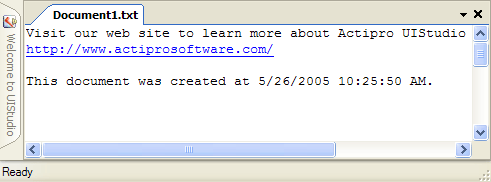
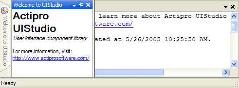

# Auto-Hide

When screen real estate runs low, tool windows can be placed into auto-hide mode via the pin button it the title bar.  This causes them to slide from their docked state into the edge of the host container control.  After they are collapsed, an auto-hide tab strip represents the tool windows.

The mouse can be hovered or clicked over an auto-hide tab to display its corresponding tool window.  When this is done, the tool window slides back into view.

*Tool window collapsed into auto-hide mode*

*Tool window slides out to reveal itself when the auto-hide tab is hovered over or clicked*

## Configuring Auto-Hide

There are a number of properties on the [DockManager](xref:@ActiproUIRoot.Controls.Docking.DockManager) component that configure the general behavior of auto-hide.

| Member | Description |
|-----|-----|
| [AutoHideButtonAffectsSelectedTabOnly](xref:@ActiproUIRoot.Controls.Docking.DockManager.AutoHideButtonAffectsSelectedTabOnly) Property | Gets or sets whether the pressing of the auto-hide button affects the selected tab only. |
| [AutoHideHideSteps](xref:@ActiproUIRoot.Controls.Docking.DockManager.AutoHideHideSteps) Property | Gets or sets the number of steps to use for animation when hiding auto-hide tool windows.  The higher the number of steps, the slower the tool window hides.  Setting this value to `1` forces the tool window to hide instantly. |
| [AutoHideShowSteps](xref:@ActiproUIRoot.Controls.Docking.DockManager.AutoHideShowSteps) Property | Gets or sets the number of steps to use for animation when showing auto-hide tool windows.  The higher the number of steps, the slower the tool window displays.  Setting this value to `1` forces the tool window to show instantly. |
| [AutoHideShowOnMouseHover](xref:@ActiproUIRoot.Controls.Docking.DockManager.AutoHideShowOnMouseHover) Property | Gets or sets whether to show auto-hidden tool windows when the mouse hovers over their tabs.  When this property is `false`, the user must click on a tab to display its related tool window.  Clicking on the tab again while the tool window is displayed will close the flyout. |
| [HideAutoHideToolWindowsAfterStateChange](xref:@ActiproUIRoot.Controls.Docking.DockManager.HideAutoHideToolWindowsAfterStateChange) Property | Gets or sets whether to hide auto-hide tool windows immediately after a state change. |
| [HideUnfocusedAutoHideToolWindowsOnMouseLeave](xref:@ActiproUIRoot.Controls.Docking.DockManager.HideUnfocusedAutoHideToolWindowsOnMouseLeave) Property | Gets or sets whether to hide unfocused auto-hide tool windows that are displayed when the mouse leaves them. |
| [IgnoreAutoHideMouseClicks](xref:@ActiproUIRoot.Controls.Docking.DockManager.IgnoreAutoHideMouseClicks) Property | Gets or sets whether to ignore mouse clicks that would hide a displayed auto-hide window. |

## Instantly Auto-Hiding All Tool Windows

An [AutoHideAllToolWindowsDockedInHost](xref:@ActiproUIRoot.Controls.Docking.DockManager.AutoHideAllToolWindowsDockedInHost*) method is provided on the [DockManager](xref:@ActiproUIRoot.Controls.Docking.DockManager) component that changes all the active tool windows docked in the host container control to be in auto-hide mode.  IDEs typically provide this option as an **Auto Hide All** menu item on a **Window** menu.
