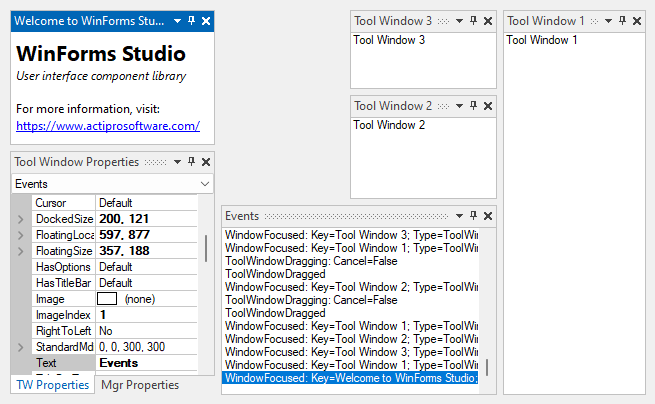

# Complex Hierarchies

Tool windows can be docked and positioned in extremely complex hierarchies.  This feature is supported in floating windows as well.

*Tool windows in a nested hierarchy*

While in the hierarchies, each tool window can be resized using splitters.  The hierarchies of tool windows can be persisted to a tool window layout and later restored.
