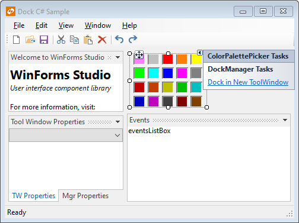
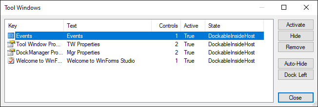

# Designer Support

The Dock controls provide design-time support, making it easy to configure the docking layout in the Visual Studio designer.  After you drop a [DockManager](xref:@ActiproUIRoot.Controls.Docking.DockManager) component on a designer `Form` from the **Toolbox**, the first thing to do is set the [HostContainerControl](xref:@ActiproUIRoot.Controls.Docking.DockManager.HostContainerControl).  This is the control that will act as the hosting container for the docking system.  This control may be a `Form` or any other type of container control.  Typically, it is the parent `Form`.

Tool window layouts created in the designer are persisted to code.  When the application is run, the layout is restored just as it was designed in the designer.

> [!NOTE]
> See the [Visual Studio Designer](../visual-studio-designer.md) topic for details and requirements for designer functionality.

## Creating a Tool Window for a Control

During design-time, you can create a tool window for a control:

1. Select the control in the designer.
1. Select the **Dock in New ToolWindow** action from the control's **Smart Tag** panel.

A new tool window will be created and docked to the host container control and the originally selected control will be set as the child control for the new tool window.

*Dock control in the designer with an on the ColorPicker Smart Tags panel*

> [!TIP]
> The same **Dock in New ToolWindow** action is also available as a designer verb on the context menu of a control when working with .NET Core or .NET 5 and higher.

## Creating a Blank Tool Window

To create a blank tool window:

1. Select the [DockManager](xref:@ActiproUIRoot.Controls.Docking.DockManager) component.
1. Select the **Create Tool Window** action from the component's **Smart Tag** panel.

A blank tool window will be created that is docked in the host container control.  The tool window is a container control, so other child controls such as textboxes can be added to it in the designer.

> [!TIP]
> The same **Create Tool Window** action is also available as a designer verb on the context menu of a [DockManager](xref:@ActiproUIRoot.Controls.Docking.DockManager) component when working with .NET Core or .NET 5 and higher.

## Moving Tool Windows

The tool windows can be moved around within the container form via drag and drop or attached to other tool windows.

## Removing Tool Windows

To remove a tool window:

1. Select the **ToolWindow** in the designer by clicking on its title bar or selecting it in the Visual Studio **Properties** window.
1. Select the **Remove ToolWindow** action from the tool window's **Smart Tag** panel.

When a tool window is removed, any child controls will be reparented to the host container control.

> [!TIP]
>
> The same **Remove ToolWindow** action is also available as a designer verb on a context menu displayed by right-clicking on the title bar of a tool window.
>
> The **Tool Windows** dialog, discussed below, can also be used to remove a tool window.

## States Supported

Tool windows support an inactive state, docked state, and an auto-hide state in the designer.  At this time, the tabbed document and floating tool window states cannot be designed.  However, they can be programmatically set at run-time and run-time tool window layouts can save and restore any tool window state.

## Using the Tool Windows Dialog

To open to **Tool Windows** dialog:

1. Select a [DockManager](xref:@ActiproUIRoot.Controls.Docking.DockManager) component or [ToolWindow](xref:@ActiproUIRoot.Controls.Docking.ToolWindow) control in the designer.
1. Select the **Tool Windows...** action from the **Smart Tag** panel to open the **Tool Windows** dialog.

*Tool Windows dialog, available from the "Tool Windows..." designer action*

> [!TIP]
>
> Double-click a [DockManager](xref:@ActiproUIRoot.Controls.Docking.DockManager) component to quickly open the **Tool Windows** dialog using the default designer action for the component.
>
> The same **Tool Windows...** action is also available as a designer verb on the context menu of a [DockManager](xref:@ActiproUIRoot.Controls.Docking.DockManager) component or [ToolWindow](xref:@ActiproUIRoot.Controls.Docking.ToolWindow) control when working with .NET Core or .NET 5 and higher.

The **Tool Windows** dialog lists all of the tool windows currently being managed by the [DockManager](xref:@ActiproUIRoot.Controls.Docking.DockManager) component.

This table describes the buttons on the dialog:

| Button | Description |
|-----|-----|
| `Activate` | Activates (makes visible) the selected tool window. |
| `Hide` | Hides the selected tool window. |
| `Remove` | Removes the selected tool window and moves all of its child controls to be parented to the host container control. |
| `Auto-Hide` | Changes the selected tool window so that it is active in auto-hide mode. |
| `Dock Left` | Docks the selected tool window by itself on the left side of the host container control. |
| `Close` | Closes the dialog. |

## Designing DocumentWindow and ToolWindow Instances

Dock supports another method of designing document and tool windows.  The [DocumentWindow](xref:@ActiproUIRoot.Controls.Docking.DocumentWindow) and [ToolWindow](xref:@ActiproUIRoot.Controls.Docking.ToolWindow) classes support instances being designed directly in the Visual Studio designer.  This means you can create a class in your project that inherits one of those classes.  Once saved, it can be opened just like you would open a `Form` or `UserControl`.  You can design it in the Visual Studio designer and then at run-time, use code to create instances of your class.  This is ideal for document windows where the same UI is replicated for each document that is opened.
