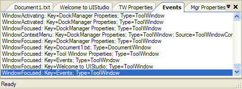

# Document Windows

Document windows are container controls that can host child controls.  They are represented by the [DocumentWindow](xref:@ActiproUIRoot.Controls.Docking.DocumentWindow) class.  They are used in the document MDI area that is controlled by a [DockManager](xref:@ActiproUIRoot.Controls.Docking.DockManager) component in either `Standard` or `Tabbed` MDI modes.  Tool windows can also be moved to the document MDI area.

*Document windows and tool windows in a single tab group*

Document windows are available to the end-user when they are active, as indicated by their [Active](xref:@ActiproUIRoot.Controls.Docking.TabbedMdiWindow.Active) property.  If they are not active, they are not located anywhere in the user interface.  The [Activate](xref:@ActiproUIRoot.Controls.Docking.TabbedMdiWindow.Activate*) method can be called to make an inactive document window active.  Likewise, the [Close](xref:@ActiproUIRoot.Controls.Docking.TabbedMdiWindow.Close*) method can be called to close a document window.

## Document Window Lifetime

The lifetime of a document window is considered to be while it is active in the layout.  By default, the [DockManager](xref:@ActiproUIRoot.Controls.Docking.DockManager) automatically disposes document windows when they are closed.  However, this behavior can be changed so that when closed, a document window simply becomes invisible and can be activated to reappear in the document MDI area.  The [DisposeDocumentWindowsAfterClose](xref:@ActiproUIRoot.Controls.Docking.DockManager.DisposeDocumentWindowsAfterClose) property on the [DockManager](xref:@ActiproUIRoot.Controls.Docking.DockManager) controls this behavior.

## Modified States

Each document window has a [Modified](xref:@ActiproUIRoot.Controls.Docking.DocumentWindow.Modified) property.  This property indicates whether the data represented in the document window has been modified since its last save.  When the property's value is `true`, an asterisk is automatically displayed in the tab for the document window.  Setting the property to `false` hides the asterisk.

## File Names and File Types

Each document window has [FileName](xref:@ActiproUIRoot.Controls.Docking.DocumentWindow.FileName) and [FileType](xref:@ActiproUIRoot.Controls.Docking.DocumentWindow.FileType) properties, allowing for the storage of a file name and type respectively.  These properties are used by default in the [Next Window Navigation](next-window-navigation.md) dialog in the description area, however the descriptions may be modified via the [NextWindowNavigationSelectionChanged](xref:@ActiproUIRoot.Controls.Docking.DockManager.NextWindowNavigationSelectionChanged) event to not use these properties.

## Document Windows Collection

The [DockManager](xref:@ActiproUIRoot.Controls.Docking.DockManager) maintains an [DocumentWindows](xref:@ActiproUIRoot.Controls.Docking.DockManager.DocumentWindows) collection that contains all of the document windows currently being managed by the manager.  After a document window is disposed, it is removed from the collection.

This [DocumentWindows](xref:@ActiproUIRoot.Controls.Docking.DockManager.DocumentWindows) collection is different than the [ActiveDocuments](xref:@ActiproUIRoot.Controls.Docking.DockManager.ActiveDocuments) collection since this collection only contains document windows, active or not.
