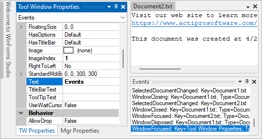
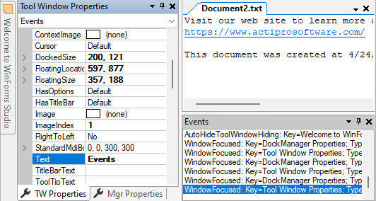
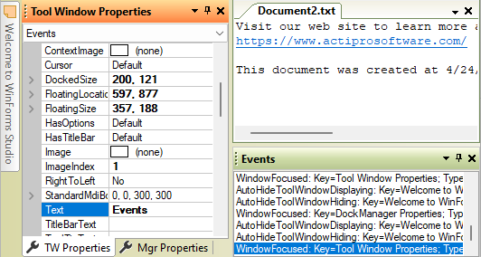
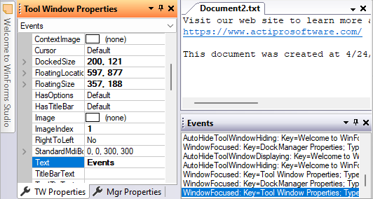
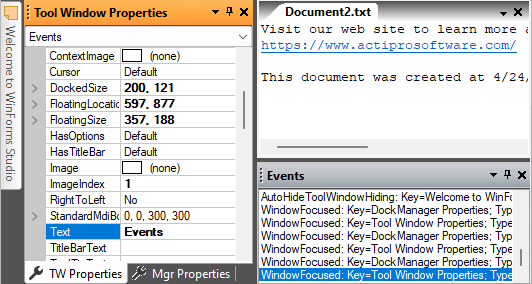

# Extensible Rendering

The Dock controls use an extensible rendering model that is based on our common object model.  The object model centers around the use of a renderer class.  The renderer measures and draws all of the elements within the control.  This is a great design because it allows you to use our pre-defined renderers or create your own.

This object model allows for three levels of rendering customization.  Choose which level of customization you wish to use:

- Use Built-In Renderers As-Is - Use the built-in rendering styles without any changes, which include many Metro, Visual Studio, and Office styles.

- Modify Properties on Built-In Renderers - Use the built-in renderers but modify the various properties on the renderers to easily create a customized appearance.

- Create Custom Renderers - Implement the [IDockRenderer](xref:@ActiproUIRoot.Controls.Docking.IDockRenderer) interface or inherit our [DockRenderer](xref:@ActiproUIRoot.Controls.Docking.DockRenderer) class to do all the measuring and drawing of the controls and their elements yourself.

These are some sample rendering styles that come with [DockManager](xref:@ActiproUIRoot.Controls.Docking.DockManager):



*Metro Light-themed Dock controls*



*Visual Studio Classic-themed Dock controls*


*Office Classic blue-themed Dock controls*



*Office Classic olive green-themed Dock controls*



*Office Classic blue-themed Dock controls*



*Office Classic black-themed Dock controls*

## DockManager Renderers

The [DockManager](xref:@ActiproUIRoot.Controls.Docking.DockManager) component uses several renderers.  Each renderer is assigned to a property on the manager.

| Member | Description |
|-----|-----|
| [DockRenderer](xref:@ActiproUIRoot.Controls.Docking.DockManager.DockRenderer) Property | Gets or sets the [IDockRenderer](xref:@ActiproUIRoot.Controls.Docking.IDockRenderer) used to render the dock controls. |
| [TabbedMdiContainerTabStripRenderer](xref:@ActiproUIRoot.Controls.Docking.DockManager.TabbedMdiContainerTabStripRenderer) Property | Gets or sets the [ITabStripRenderer](xref:@ActiproUIRoot.Controls.Docking.ITabStripRenderer) to use for drawing the `TabStrip` controls in tabbed MDI containers. |
| [ToolWindowContainerTabStripRenderer](xref:@ActiproUIRoot.Controls.Docking.DockManager.ToolWindowContainerTabStripRenderer) Property | Gets or sets the [ITabStripRenderer](xref:@ActiproUIRoot.Controls.Docking.ITabStripRenderer) to use for drawing the `TabStrip` controls in tool window containers. |

## Use Built-In Renderers As-Is

Dock includes these built-in renderers, which support Metro, Visual Studio, Office, and other classic styles:

| Renderer | Description |
|-----|-----|
| [MetroDockRenderer](xref:@ActiproUIRoot.Controls.Docking.MetroDockRenderer) | Capable of drawing Metro styles (Light and Dark) for dock controls.  To change to a different style, change the [BaseColorSchemeType](xref:@ActiproUIRoot.Controls.Docking.MetroDockRenderer.BaseColorSchemeType). |
| [OfficeClassicDockRenderer](xref:@ActiproUIRoot.Controls.Docking.OfficeClassicDockRenderer) | Capable of drawing all Office classic styles (Blue, Silver, Black), Luna styles (Blue, Olive Green, Silver), and Windows Classic).  To change to a different style, change the [BaseColorSchemeType](xref:@ActiproUIRoot.Controls.Docking.OfficeClassicDockRenderer.BaseColorSchemeType). |
| [VisualStudioDockRenderer](xref:@ActiproUIRoot.Controls.Docking.VisualStudioDockRenderer) | Capable of drawing Visual Studio classic dock controls. |
| [VisualStudioClassicDockRenderer](xref:@ActiproUIRoot.Controls.Docking.VisualStudioClassicDockRenderer) | Capable of drawing Visual Studio classic dock controls. |
| [WindowsClassicDockRenderer](xref:@ActiproUIRoot.Controls.Docking.WindowsClassicDockRenderer) | Capable of drawing Windows classic dock controls. |

## Color Tinting Color Schemes

With one line of code, any `WindowsColorScheme` can be tinted so that all of the colors are altered.  For instance, you can easily create a tan or red color scheme and then use those color schemes with the [OfficeClassicDockRenderer](xref:@ActiproUIRoot.Controls.Docking.OfficeClassicDockRenderer), [OfficeClassicDocumentWindowTabStripRenderer](xref:@ActiproUIRoot.Controls.Docking.OfficeClassicDocumentWindowTabStripRenderer), and [OfficeClassicToolWindowTabStripRenderer](xref:@ActiproUIRoot.Controls.Docking.OfficeClassicToolWindowTabStripRenderer) classes like this:

This code shows how to load a custom tan-tinted color scheme (displayed in the screenshot above) that is based on the built-in Luna blue theme:

```csharp
var scheme = new WindowsColorScheme("Tan", WindowsColorSchemeType.LunaBlue, Color.Tan);
dockManager.DockRenderer = new ActiproSoftware.UI.WinForms.Controls.Docking.OfficeClassicDockRenderer(scheme);
dockManager.TabbedMdiContainerTabStripRenderer = new ActiproSoftware.UI.WinForms.Controls.Docking.OfficeClassicDocumentWindowTabStripRenderer(scheme);
dockManager.ToolWindowContainerTabStripRenderer = new ActiproSoftware.UI.WinForms.Controls.Docking.OfficeClassicToolWindowTabStripRenderer(scheme);
```

## Customizing Specific Colors in a Color Scheme

Each color property on the `WindowsColorScheme` class has a getter and setter.  This means that after a base color scheme is selected for use, you may alter specific colors as needed.

This code shows how change the background of menus to be `LightBlue` for the built-in Windows Classic color scheme.

```csharp
WindowsColorScheme.WindowsClassic.MenuBack = Color.LightBlue;
```

> [!NOTE]
> Any renderers created before the color settings were changed may need to be refreshed for the color changes to take effect in the renderer.

## Modify Properties on Built-In Renderers

Select a base built-in renderer to use by following the steps above.  Then use the designer to change its properties.  You can change fonts, colors, backgrounds, measuring parameters, etc.  Our built-in renderers give you a lot of options that you can use to customize the look and feel of the controls.

## Create Custom Renderers

For the most flexibility over what is measured and rendered, create a class that implements the [IDockRenderer](xref:@ActiproUIRoot.Controls.Docking.IDockRenderer) interface.  Alternatively, you can create a class that inherits our [DockRenderer](xref:@ActiproUIRoot.Controls.Docking.DockRenderer) or one of its descendants.  The renderer interface has methods that measure and draw the controls and their elements.

After your custom renderer class has been created, assign it to the [DockRenderer](xref:@ActiproUIRoot.Controls.Docking.DockManager.DockRenderer) property of each [DockManager](xref:@ActiproUIRoot.Controls.Docking.DockManager) that should use it for drawing.

## Customizing Individual Windows

Renderer settings affect the rendering of all the controls that use the renderer.  However, there are other properties on each [TabbedMdiWindow](xref:@ActiproUIRoot.Controls.Docking.TabbedMdiWindow) that allow for customization of that particular instance.  These are the properties that can be used to customize a specific window:

| Member | Description |
|-----|-----|
| [BackgroundFill](xref:@ActiproUIRoot.Controls.Docking.TabbedMdiWindow.BackgroundFill) Property | Gets or sets the pane-specific `BackgroundFill` for the window. |
