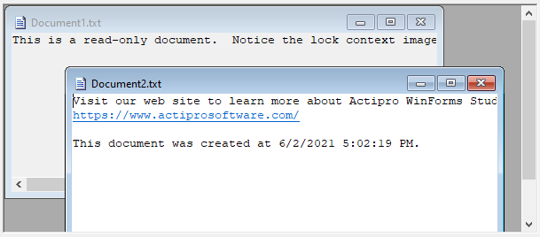

# Standard MDI

The Dock controls have two modes of multiple document interface (MDI) support, `Standard` and `Tabbed`.  The `Standard` interface provides the normal type of MDI that was developed in earlier versions of Windows.

Set the [DocumentMdiStyle](xref:@ActiproUIRoot.Controls.Docking.DockManager.DocumentMdiStyle) property of the [DockManager](xref:@ActiproUIRoot.Controls.Docking.DockManager) component to `Standard` to use this MDI mode.  MDI modes can be changed at run-time.

The standard <kbd>Ctrl</kbd>+<kbd>Tab</kbd> hotkey provides for quick switching between selected document windows.

*Document windows in standard MDI mode*

Even though document windows can be arranged and tiled in multiple ways within the MDI client area, a single collection of all active documents is available from the [DockManager](xref:@ActiproUIRoot.Controls.Docking.DockManager) component.  See the [Working with Documents](working-with-documents.md) topic for more information on this collection.

## Cascading and Tiling Documents

Document windows in `Standard` MDI mode can be cascaded, tiled horizontally, or tiled vertically.  Helper methods on the [DockManager](xref:@ActiproUIRoot.Controls.Docking.DockManager) component have been provided to implement this behavior.

| Member | Description |
|-----|-----|
| [CascadeDocuments](xref:@ActiproUIRoot.Controls.Docking.DockManager.CascadeDocuments*) Method | Cascades the active documents while in `Standard` MDI mode. |
| [TileDocumentsHorizontally](xref:@ActiproUIRoot.Controls.Docking.DockManager.TileDocumentsHorizontally*) Method | Tiles the active documents horizontally while in `Standard` MDI mode. |
| [TileDocumentsVertically](xref:@ActiproUIRoot.Controls.Docking.DockManager.TileDocumentsVertically*) Method | Tiles the active documents vertically while in `Standard` MDI mode. |

## Setting the MDI Window Bounds

The [StandardMdiBounds](xref:@ActiproUIRoot.Controls.Docking.TabbedMdiWindow.StandardMdiBounds) property can directly set the bounds of an active standard MDI window.  It also can optionally control the bounds of the MDI window when it is activated.  By default, each MDI window is positioned and sized by the system when being activated, however by setting the [StandardMdiAutoWindowLayoutEnabled](xref:@ActiproUIRoot.Controls.Docking.DockManager.StandardMdiAutoWindowLayoutEnabled) property to `false`, each MDI window's bounds will be set to whatever its [StandardMdiBounds](xref:@ActiproUIRoot.Controls.Docking.TabbedMdiWindow.StandardMdiBounds) property value is when the window is activated.
