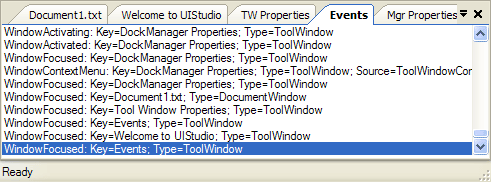
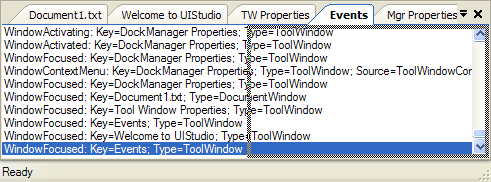
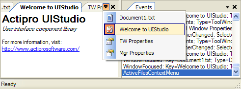

# Tabbed MDI

The Dock controls have two modes of multiple document interface (MDI) support, `Standard` and `Tabbed`.  The `Tabbed` interface is very robust and maximizes the document area screen real estate.

Set the [DocumentMdiStyle](xref:@ActiproUIRoot.Controls.Docking.DockManager.DocumentMdiStyle) property of the [DockManager](xref:@ActiproUIRoot.Controls.Docking.DockManager) component to `Tabbed` to use this MDI mode.  MDI modes can be changed at run-time.

**Close** buttons can optionally be displayed for each document window and an event can be intercepted to cancel the closing of any document window.

The standard <kbd>Ctrl</kbd>+<kbd>Tab</kbd> hotkey provides for quick switching between selected document windows.

Even though document windows can be split into multiple tab groups, a single collection of all active documents is available from the [DockManager](xref:@ActiproUIRoot.Controls.Docking.DockManager) component.  See the [Working with Documents](working-with-documents.md) topic for more information on this collection.

## Images on Tabs

The [TabbedMdiTabImagesVisible](xref:@ActiproUIRoot.Controls.Docking.DockManager.TabbedMdiTabImagesVisible) property on the [DockManager](xref:@ActiproUIRoot.Controls.Docking.DockManager) component indicates whether document window images should be displayed in the tabs.

## Tab Overflow Styles

Multiple tab overflow styles are supported.  The tab overflow style is set by using the [TabbedMdiContainerButtonStyle](xref:@ActiproUIRoot.Controls.Docking.DockManager.TabbedMdiContainerButtonStyle) property on the [DockManager](xref:@ActiproUIRoot.Controls.Docking.DockManager) component

| Value | Description |
|-----|-----|
| `None` | Does nothing to handle tab overflow. |
| `DropDownButton` | A drop-down button allows for listing of open documents. |
| `ScrollButtons` | Scroll buttons appear allowing for smooth scrolling to tabs that are out of the visible bounds. |
| `DropDownAndScrollButtons` | A drop-down button and scroll buttons are visible. |

## Tab Groups

Document window (and tool windows in the MDI area) tabs can be dragged by the end-user to create new tab groups.  Context menus also provide access to this functionality via the object model.  Tab groups are represented by the [TabbedMdiContainer](xref:@ActiproUIRoot.Controls.Docking.TabbedMdiContainer) class.

The [DockManager](xref:@ActiproUIRoot.Controls.Docking.DockManager).[MultipleTabbedMdiGroupsEnabled](xref:@ActiproUIRoot.Controls.Docking.DockManager.MultipleTabbedMdiGroupsEnabled) property controls whether features are available to the end user that let them create new tabbed MDI groups.

See the next several screenshots for an example of a tool window in the MDI area being dragged to create a new tab group.

*Document and tool windows in a single tab group*

*Tab for the Events tool window being dragged to the right side of the document container*

*Second tab group created when the window was dropped, and mouse is clicked over an Active Files button*

## Programmatically Controlling Tab Groups

There are a number of members on the on the [TabbedMdiWindow](xref:@ActiproUIRoot.Controls.Docking.TabbedMdiWindow) control that provide programmatic access to tab groups.

| Member | Description |
|-----|-----|
| [MoveToNewHorizontalTabbedMdiContainer](xref:@ActiproUIRoot.Controls.Docking.TabbedMdiWindow.MoveToNewHorizontalTabbedMdiContainer*) Method | Creates a new horizontal [TabbedMdiContainer](xref:@ActiproUIRoot.Controls.Docking.TabbedMdiContainer) for the window. |
| [MoveToNewVerticalTabbedMdiContainer](xref:@ActiproUIRoot.Controls.Docking.TabbedMdiWindow.MoveToNewVerticalTabbedMdiContainer*) Method | Creates a new vertical [TabbedMdiContainer](xref:@ActiproUIRoot.Controls.Docking.TabbedMdiContainer) for the window. |
| [MoveToNextTabbedMdiContainer](xref:@ActiproUIRoot.Controls.Docking.TabbedMdiWindow.MoveToNextTabbedMdiContainer*) Method | Moves the window to the next [TabbedMdiContainer](xref:@ActiproUIRoot.Controls.Docking.TabbedMdiContainer). |
| [MoveToPreviousTabbedMdiContainer](xref:@ActiproUIRoot.Controls.Docking.TabbedMdiWindow.MoveToPreviousTabbedMdiContainer*) Method | Moves the window to the previous [TabbedMdiContainer](xref:@ActiproUIRoot.Controls.Docking.TabbedMdiContainer). |
| [TabbedMdiContainer](xref:@ActiproUIRoot.Controls.Docking.TabbedMdiWindow.TabbedMdiContainer) Property | Gets the [TabbedMdiContainer](xref:@ActiproUIRoot.Controls.Docking.TabbedMdiContainer) that contains the window. |

## Aligning the Tab Containers of Tab Groups

The [DockManager](xref:@ActiproUIRoot.Controls.Docking.DockManager).[TabbedMdiTabsAlignNear](xref:@ActiproUIRoot.Controls.Docking.DockManager.TabbedMdiTabsAlignNear) property defaults to a value of `true`.  This means that the tab containers of tab groups will align to the left side of the tab group.  When set to `false`, the tab container will align to the right side of the tab group.

## Displaying the Active Files Menu

The [DockManager](xref:@ActiproUIRoot.Controls.Docking.DockManager) component raises the [ActiveFilesContextMenu](xref:@ActiproUIRoot.Controls.Docking.DockManager.ActiveFilesContextMenu) event when the **Active Files** button is clicked in the tabstrip.  This button is only visible when the [TabbedMdiContainerButtonStyle](xref:@ActiproUIRoot.Controls.Docking.DockManager.TabbedMdiContainerButtonStyle) property is set to `DropDownList`.

By default, a menu will display containing a list of the currently active tool and document windows in the tabbed MDI container.  This default menu can be cancelled by setting the `Cancel` property of the event arguments to `true`.  A custom menu can be displayed in its place.

## Floating Documents

Tabbed MDI documents support floating if the [DockManager](xref:@ActiproUIRoot.Controls.Docking.DockManager).[DocumentWindowsCanFloat](xref:@ActiproUIRoot.Controls.Docking.DockManager.DocumentWindowsCanFloat) property is set to `true`.  Once that property is enabled, you can drag and drop a tabbed MDI document tab outside of the tabbed MDI area to float it.  You can alternatively right-click on a tabbed MDI document tab to show its context menu, and click the **Floating** menu item to float the document into its own window.  This window may be moved to another monitor, or just kept overlapping with the main window.

To dock the floating document back into the docking hierarchy, drag and drop it on the tabbed MDI area's dock guide, or right-click on the floating document's title bar to show its context menu, and click the **Tabbed Document** menu item.

## Layout Serialization

The tabbed MDI area's layout can be serialized to XML and then later deserialized, which is similar to a subset of the [Tool Window Layouts](tool-window-layouts.md) feature.

> [!NOTE]
> The methods described below only function for tabbed MDI and cannot be used with standard MDI.

All documents (document windows or tool windows) whose layout data will be restored from the serialized XML need to already be registered with the [DockManager](xref:@ActiproUIRoot.Controls.Docking.DockManager) via its [DocumentWindows](xref:@ActiproUIRoot.Controls.Docking.DockManager.DocumentWindows) and [ToolWindows](xref:@ActiproUIRoot.Controls.Docking.DockManager.ToolWindows) collections.

### Saving Layout Data

Tabbed MDI layout data can be persisted in XML format and loaded at a later time.  Probably the two most common ways to store layouts are in files and in a database.

The [SaveDocumentLayoutToFile](xref:@ActiproUIRoot.Controls.Docking.DockManager.SaveDocumentLayoutToFile*) method is used to save tabbed MDI layout data to a file.  This method saves the layout data of all documents (document windows or tool windows) that are currently active in the layout.  The method accepts the full path to the data file as a parameter.

Saving to other storage formats can also be accomplished.  The [DocumentLayoutData](xref:@ActiproUIRoot.Controls.Docking.DockManager.DocumentLayoutData) property returns the tabbed MDI layout data expressed in an `XmlDocument`.  The `XmlDocument` can be written to a database or persisted in some other form.

### Loading Layout Data

When loaded, tabbed MDI layout data restores the already-known documents (document windows or tool windows that are registered with the [DockManager](xref:@ActiproUIRoot.Controls.Docking.DockManager) component) to their proper locations and sizes within the tabbed MDI area.

The layout data loading code attempts to match the keys of documents that were stored in the layout to the keys of document or tool windows contained in the [DocumentWindows](xref:@ActiproUIRoot.Controls.Docking.DockManager.DocumentWindows) and [ToolWindows](xref:@ActiproUIRoot.Controls.Docking.DockManager.ToolWindows) collections.  If there is layout data for a document that is not known to the [DockManager](xref:@ActiproUIRoot.Controls.Docking.DockManager), it is ignored.  If a document window was active prior to layout load, but no layout information was found in the XML for it, it will be closed and, if the [DockManager](xref:@ActiproUIRoot.Controls.Docking.DockManager).[DisposeDocumentWindowsAfterClose](xref:@ActiproUIRoot.Controls.Docking.DockManager.DisposeDocumentWindowsAfterClose) property is `true`, also destroyed.  If a tool window was active in the tabbed MDI prior to layout load, but no layout information was found in the XML for it, it will be moved to the first tabbed MDI container.

The [LoadDocumentLayoutFromFile](xref:@ActiproUIRoot.Controls.Docking.DockManager.LoadDocumentLayoutFromFile*) method is used to load tabbed MDI layout data from a file.  The method accepts the full path to the data file as a parameter.

Loading from other storage formats can also be accomplished.  For instance, if the XML layout data was stored in a database, the layout data should be loaded into an `XmlDocument` class and then set to the [DocumentLayoutData](xref:@ActiproUIRoot.Controls.Docking.DockManager.DocumentLayoutData) property.  The setting of this property loads the specified layout data.
