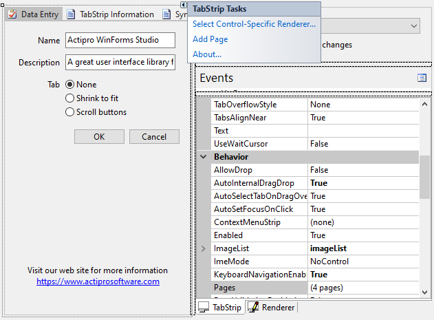

# Designer Support

[TabStrip](xref:ActiproSoftware.UI.WinForms.Controls.Docking.TabStrip) provides rich design-time support, making it easy to configure the control in the Visual Studio designer.  After you drop a [TabStrip](xref:ActiproSoftware.UI.WinForms.Controls.Docking.TabStrip) control on a designer `Form` from the **Toolbox**, toggle the **Smart Tag** panel for a list of designer actions. The designer actions can also be accessed from the control's context menu.  The **Add Page** action can be used to a add a new [TabStripPage](xref:ActiproSoftware.UI.WinForms.Controls.Docking.TabStripPage).  Alternatively you may modify the [Pages](xref:ActiproSoftware.UI.WinForms.Controls.Docking.TabStrip.Pages) collection from the **Properties** window to add/remove pages or reorder them.

*TabStrip in the designer with Smart Tag panel displayed*

After one or more pages have been added to the control, child controls can be added to them.  The pages act like container controls.  Child controls may be docked within them or positioned without docking.  To make another page visible, first click the [TabStrip](xref:ActiproSoftware.UI.WinForms.Controls.Docking.TabStrip) to give it focus and then click on a page's button to display it.  Alternatively, you can select a [TabStripPage](xref:ActiproSoftware.UI.WinForms.Controls.Docking.TabStripPage) in the Visual Studio **Properties** window and the [TabStrip](xref:ActiproSoftware.UI.WinForms.Controls.Docking.TabStrip) will display the newly selected page.
