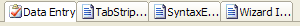
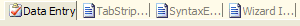
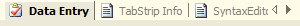
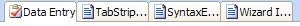

# Extensible Rendering

[TabStrip](xref:ActiproSoftware.UI.WinForms.Controls.Docking.TabStrip) uses an extensible rendering model that is based on our common object model.  The object model centers around the use of a renderer class.  The renderer measures and draws all of the elements within the control.  This is a great design because it allows you to use our pre-defined renderers or create your own.

This object model allows for three levels of rendering customization.  Choose which level of customization you wish to use:

- Use Built-In Renderers As-Is - Use the built-in rendering styles without any changes, which include all Visual Studio and Office styles (Blue, Olive, Silver, and Windows Classic) for tool/document windows.
- Modify Properties on Built-In Renderers - Use the built-in renderers but modify the various properties on the renderers to easily create a customized appearance.
- Create Custom Renderers - Implement the [ITabStripRenderer](xref:ActiproSoftware.UI.WinForms.Controls.Docking.ITabStripRenderer) interface or inherit our [TabStripRenderer](xref:ActiproSoftware.UI.WinForms.Controls.Docking.TabStripRenderer) class to do all the measuring and drawing of the controls and their elements yourself.

These are some sample rendering styles that come with [TabStrip](xref:ActiproSoftware.UI.WinForms.Controls.Docking.TabStrip):











## Use Built-In Renderers As-Is

Dock includes these built-in renderers:

| Renderer | Description |
|-----|-----|
| [MetroLightToolWindowTabStripRenderer](xref:ActiproSoftware.UI.WinForms.Controls.Docking.MetroLightToolWindowTabStripRenderer) | Capable of drawing a Metro Light tool window. |
| [MetroLightDocumentWindowTabStripRenderer](xref:ActiproSoftware.UI.WinForms.Controls.Docking.MetroLightDocumentWindowTabStripRenderer) | Capable of drawing a Metro Light document window. |
| [VisualStudio2005ToolWindowTabStripRenderer](xref:ActiproSoftware.UI.WinForms.Controls.Docking.VisualStudio2005ToolWindowTabStripRenderer) | Capable of drawing a Visual Studio 2005 tool window. |
| [VisualStudio2005DocumentWindowTabStripRenderer](xref:ActiproSoftware.UI.WinForms.Controls.Docking.VisualStudio2005DocumentWindowTabStripRenderer) | Capable of drawing a Visual Studio 2005 document window. |
| [VisualStudio2005Beta2ToolWindowTabStripRenderer](xref:ActiproSoftware.UI.WinForms.Controls.Docking.VisualStudio2005Beta2ToolWindowTabStripRenderer) | Capable of drawing a Visual Studio 2005 Beta 2 tool window. |
| [VisualStudio2002ToolWindowTabStripRenderer](xref:ActiproSoftware.UI.WinForms.Controls.Docking.VisualStudio2002ToolWindowTabStripRenderer) | Capable of drawing a Visual Studio 2002 tool window. |
| [VisualStudio2002DocumentWindowTabStripRenderer](xref:ActiproSoftware.UI.WinForms.Controls.Docking.VisualStudio2002DocumentWindowTabStripRenderer) | Capable of drawing a Visual Studio 2002 document window. |
| [Office2003ToolWindowTabStripRenderer](xref:ActiproSoftware.UI.WinForms.Controls.Docking.Office2003ToolWindowTabStripRenderer) | Capable of drawing all Office styles (Blue, Olive, Silver, and Windows Classic) for a tool window.  To change to a different style, change the [BaseColorSchemeType](xref:ActiproSoftware.UI.WinForms.Controls.Docking.Office2003ToolWindowTabStripRenderer.BaseColorSchemeType). |
| [Office2003DocumentWindowTabStripRenderer](xref:ActiproSoftware.UI.WinForms.Controls.Docking.Office2003DocumentWindowTabStripRenderer) | Capable of drawing all Office styles (Blue, Olive, Silver, and Windows Classic) for a document window.  To change to a different style, change the [BaseColorSchemeType](xref:ActiproSoftware.UI.WinForms.Controls.Docking.Office2003DocumentWindowTabStripRenderer.BaseColorSchemeType). |
| [Office2003VisualStudio2005Beta2ToolWindowTabStripRenderer](xref:ActiproSoftware.UI.WinForms.Controls.Docking.Office2003VisualStudio2005Beta2ToolWindowTabStripRenderer) | Capable of drawing all Office styles (Blue, Olive, Silver, and Windows Classic) for a tool window, using a style similar to the Visual Studio 2005 Beta 2 style.  To change to a different style, change the [BaseColorSchemeType](xref:ActiproSoftware.UI.WinForms.Controls.Docking.Office2003ToolWindowTabStripRenderer.BaseColorSchemeType). |

## Color Tinting Color Schemes

With one line of code, any `WindowsColorScheme` can be tinted so that all of the colors are altered.  For instance, you can easily create a custom color scheme and then use those color schemes with the [Office2003DocumentWindowTabStripRenderer](xref:ActiproSoftware.UI.WinForms.Controls.Docking.Office2003DocumentWindowTabStripRenderer) and [Office2003ToolWindowTabStripRenderer](xref:ActiproSoftware.UI.WinForms.Controls.Docking.Office2003ToolWindowTabStripRenderer) classes.

This code shows how to load a custom purple-tinted color scheme that is based on the built-in Windows XP blue theme:

```csharp
WindowsColorScheme scheme = new WindowsColorScheme("Purple", WindowsColorSchemeType.WindowsXPBlue, Color.Purple);
tabStrip.Renderer = new ActiproSoftware.UI.WinForms.Controls.Docking.Office2003DocumentWindowTabStripRenderer(scheme);
```

## Customizing Specific Colors in a Color Scheme

Each color property on the `WindowsColorScheme` class has a getter and setter.  This means that after a base color scheme is selected for use, you may alter specific colors as needed.

This code shows how change the background of menus to be `LightBlue` for the built-in Windows Classic color scheme.

```csharp
WindowsColorScheme.WindowsClassic.MenuBack = Color.LightBlue;
```

> [!NOTE]
> Any renderers created before the color settings were changed may need to be refreshed for the color changes to take effect in the renderer.

## Modify Properties on Built-In Renderers

Select a base built-in renderer to use by following the steps above.  Then use the designer to change its properties.  You can change fonts, colors, backgrounds, measuring parameters, etc.  Our built-in renderers give you a lot of options that you can use to customize the look and feel of the controls.

## Create Custom Renderers

For the most flexibility over what is measured and rendered, create a class that implements the [ITabStripRenderer](xref:ActiproSoftware.UI.WinForms.Controls.Docking.ITabStripRenderer) interface.  Alternatively, you can create a class that inherits our [TabStripRenderer](xref:ActiproSoftware.UI.WinForms.Controls.Docking.TabStripRenderer) or one of its descendants.  The renderer interface has methods that measure and draw the controls and their elements.

After your custom renderer class has been created, assign it to the [Renderer](xref:ActiproSoftware.UI.WinForms.Controls.Docking.TabStrip.Renderer) property of each [TabStrip](xref:ActiproSoftware.UI.WinForms.Controls.Docking.TabStrip) that should use it for drawing.

## Customizing Individual Tab Pages

Renderer settings affect the rendering of all the controls that use the renderer.  However there are other properties on each [TabStripPage](xref:ActiproSoftware.UI.WinForms.Controls.Docking.TabStripPage) that allow for customization of that particular instance.  These are the properties that can be used to customize a specific page:

| Member | Description |
|-----|-----|
| [BackgroundFill](xref:ActiproSoftware.UI.WinForms.Controls.Docking.TabStripPage.BackgroundFill) Property | Gets or sets the page-specific `BackgroundFill` for the tabstrip page. |
| [TabSelectedBackgroundFill](xref:ActiproSoftware.UI.WinForms.Controls.Docking.TabStripPage.TabSelectedBackgroundFill) Property | Gets or sets the page-specific `BackgroundFill` for the page's tab when it is selected. |
| [TabSelectedFont](xref:ActiproSoftware.UI.WinForms.Controls.Docking.TabStripPage.TabSelectedFont) Property | Gets or sets the page-specific `Font` to use for drawing the page's tab when it is selected. |
| [TabSelectedForeColor](xref:ActiproSoftware.UI.WinForms.Controls.Docking.TabStripPage.TabSelectedForeColor) Property | Gets or sets the page-specific foreground color of the page's tab when it is selected. |
| [TabUnselectedBackgroundFill](xref:ActiproSoftware.UI.WinForms.Controls.Docking.TabStripPage.TabUnselectedBackgroundFill) Property | Gets or sets the page-specific `BackgroundFill` for the page's tab when it is unselected. |
| [TabUnselectedFont](xref:ActiproSoftware.UI.WinForms.Controls.Docking.TabStripPage.TabUnselectedFont) Property | Gets or sets the page-specific `Font` to use for drawing the page's tab when it is unselected. |
| [TabUnselectedForeColor](xref:ActiproSoftware.UI.WinForms.Controls.Docking.TabStripPage.TabUnselectedForeColor) Property | Gets or sets the page-specific foreground color of the page's tab when it is unselected. |
