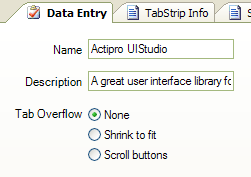

# Overview

[TabStrip](xref:ActiproSoftware.UI.WinForms.Controls.Docking.TabStrip) provides an alternative tab-based control to the `TabControl` that is included in .NET Framework, .NET Core, or .NET 5+. [TabStrip](xref:ActiproSoftware.UI.WinForms.Controls.Docking.TabStrip) has a more robust user interface in that it fully supports [customized rendering](extensible-rendering.md), [tab alignment](tab-alignments.md) on any side, special handling for [tab overflow](tab-overflow-styles.md), control over minimum/maximum tab sizes, interactive tooltip handling, drag/drop reordering of tabs, and more.

*The TabStrip control*

The [TabStrip](xref:ActiproSoftware.UI.WinForms.Controls.Docking.TabStrip) control has full [Visual Studio designer support](designer-support.md).  As page buttons are clicked or pages selected in the designer's **Properties** window, the control updates to show the page and its contents.  The page acts as a container control and can be used to host any type of child control.

## Feature List

- Built-in rendering styles include Metro Light, Visual Studio 2005/2002, and all Office 2007/2003 styles.
- Robust rendering interface allows for totally [customized rendering](extensible-rendering.md).
- Use as a replacement for the built-in .NET `TabControl`.
- [Align tabs](tab-alignments.md) to the left, top, right, or bottom.
- Optional display of close button.
- Optional display of options button.
- Three modes of [tab overflow](tab-overflow-styles.md) handling (normal, shrink-to-fit, and scroll buttons).
- Scroll buttons overflow mode provides smooth scrolling of tabs.
- Set images and text for tabs.
- Control minimum and maximum tab sizes.
- Handle an event to provide [tooltip text](tooltips.md) for tabs on-the-fly.
- Ability to handle automatic drag/drop reordering of tabs.
- Option to hide tabs if only one tab is open.
- Custom [context menus](context-menus.md) can be displayed.
- Ability to [cancel selected tab changes](page-selection.md).
- Full [designer support](designer-support.md).
