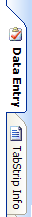

# Tab Alignments

The [TabStrip](xref:@ActiproUIRoot.Controls.Docking.TabStrip) control can align its tabs to any side.  This enables it to be used in multiple scenarios.

Each built-in rendering style includes full support for rendering tabs on each side.

## Changing the Tab Alignment

To change the alignment of tabs in a [TabStrip](xref:@ActiproUIRoot.Controls.Docking.TabStrip), change the value of the [TabAlignment](xref:@ActiproUIRoot.Controls.Docking.TabStrip.TabAlignment) property.  It uses a [TabStripTabAlignment](xref:@ActiproUIRoot.Controls.Docking.TabStripTabAlignment) enumeration value.

## Aligning the Tab Container

The [TabStrip](xref:@ActiproUIRoot.Controls.Docking.TabStrip).[TabsAlignNear](xref:@ActiproUIRoot.Controls.Docking.TabStrip.TabsAlignNear) property defaults to a value of `true`.  This means that the tab container will align to the left/top side of the control, depending on the tab alignment orientation.  When set to `false`, the tab container will align to the right/bottom side of the control, depending on the tab alignment orientation.
