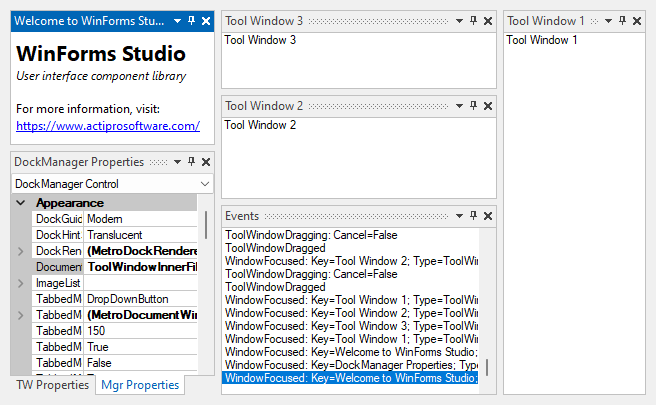

# Tool Window Inner-Fill

The Dock controls can be placed in tool window inner-fill mode, which hides the client area of the host container control.  While in this mode, tool windows fill the entire interior of the host container control.

Set the [DocumentMdiStyle](xref:@ActiproUIRoot.Controls.Docking.DockManager.DocumentMdiStyle) property of the [DockManager](xref:@ActiproUIRoot.Controls.Docking.DockManager) component to `ToolWindowInnerFill` to use this mode.  This can be changed at run-time.

*Tool windows in inner-fill mode*

While in the tool window inner-fill mode, all the normal tool window features (other than being moved to the MDI area) are available.
