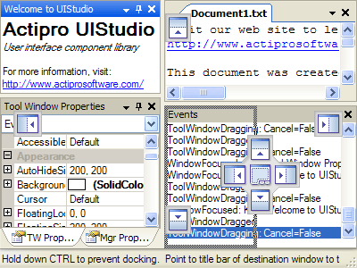

# Tool Windows

Tool windows are container controls that can host child controls.  They are represented by the [ToolWindow](xref:@ActiproUIRoot.Controls.Docking.ToolWindow) class.  They can be moved around and docked anywhere within the controls managed by a [DockManager](xref:@ActiproUIRoot.Controls.Docking.DockManager) component.  They can even be torn off and moved to floating windows.

Tool windows are available to the end-user when they are active, as indicated by their [Active](xref:@ActiproUIRoot.Controls.Docking.TabbedMdiWindow.Active) property.  If they are not active, they are not located anywhere in the user interface.  The [Activate](xref:@ActiproUIRoot.Controls.Docking.TabbedMdiWindow.Activate*) method can be called to make an inactive tool window active.  Likewise, the [Close](xref:@ActiproUIRoot.Controls.Docking.TabbedMdiWindow.Close*) method can be called to close a tool window.

The end-user may initiate a drag operation by grabbing the tool window title bar and dragging it.  Alternatively, if a tool window is "attached" to another tool window (where two or more tool windows share the same bounds but a `TabStrip` controls which tool window is displayed), the tab representing the tool window may be dragged to start a drag operation.

During a drag operation, dock guides appear indicating where the tool window may be docked.  By moving the mouse over the dock guides, a drop-target appears indicating where the tool window will reside if the mouse button is released.

*Tool window dock guides displayed during a tool window drag operation*

Tool window layouts can be saved to a file or to an `XmlDocument` object.  They later can be reloaded to instantly restore the states and positions of each tool window.  See the [Tool Window Layouts](tool-window-layouts.md) topic for more information on layouts.

Tool windows can be programmatically created and destroyed.  By using the powerful dock control object model, all aspects of the tool windows can be controlled.  Tool windows can be docked via code and properties can set various tool window-specific options.  See the [Controlling Window Capabilities](controlling-window-capabilities.md) topic for more information all the functionality that can be customized for each tool window.

## Tool Window States

Each tool window has a number of different states that it can be in.  The current state can be returned or set by using the [State](xref:@ActiproUIRoot.Controls.Docking.ToolWindow.State) property on the [ToolWindow](xref:@ActiproUIRoot.Controls.Docking.ToolWindow) class.  The state value is specified using the [ToolWindowState](xref:@ActiproUIRoot.Controls.Docking.ToolWindowState) enumeration and indicates the state of the tool window when it is active.

| Value | Description |
|-----|-----|
| `DockableInsideHost` | The tool window is docked in a tool window container in the host control. |
| `DockableOutsideHost` | The tool window is docked in a tool window container that is in a floating tool window container. |
| `Floating` | The tool window is alone in a floating tool window container and may not be docked during drag operations. |
| `AutoHide` | The tool window is auto-hidden along the side of the host control. |
| `TabbedDocument` | The tool window is a tabbed document in a document container. |

When a tool window is hidden, it stores layout data so that if re-activated, it can restore back to its previous state, location, and size.

## Tool Windows Collection

The [DockManager](xref:@ActiproUIRoot.Controls.Docking.DockManager) maintains a [ToolWindows](xref:@ActiproUIRoot.Controls.Docking.DockManager.ToolWindows) collection that contains all of the tool windows currently being managed by the manager.  After a tool window is disposed, it is removed from the collection.

## Tool Window Events

There are several tool window-specific events that are raised on the [DockManager](xref:@ActiproUIRoot.Controls.Docking.DockManager) component.  See the [Window Lifecycle](window-lifecycle.md) topic for more information on other general lifecycle events that occur for both tool and document windows.

| Member | Description |
|-----|-----|
| [ToolWindowDragging](xref:@ActiproUIRoot.Controls.Docking.DockManager.ToolWindowDragging) Event | Occurs before one or more tool windows are dragged by the user. |
| [ToolWindowDragged](xref:@ActiproUIRoot.Controls.Docking.DockManager.ToolWindowDragged) Event | Occurs after one or more tool windows are dragged by the user. |
| [AutoHideToolWindowDisplaying](xref:@ActiproUIRoot.Controls.Docking.DockManager.AutoHideToolWindowDisplaying) Event | Occurs before a tool window in auto-hide mode is displayed. |
| [AutoHideToolWindowHiding](xref:@ActiproUIRoot.Controls.Docking.DockManager.AutoHideToolWindowHiding) Event | Occurs before a tool window in auto-hide mode is hidden. |

These events are also present on the [ToolWindow](xref:@ActiproUIRoot.Controls.Docking.ToolWindow) control:

| Member | Description |
|-----|-----|
| [StateChanged](xref:@ActiproUIRoot.Controls.Docking.TabbedMdiWindow.StateChanged) Event | Occurs after the window's `State` property has changed. |

## Dock Guide Styles

Dock guides are used to aid the end-user in selecting the drop location for a tool window that is being dragged.  The Dock controls support multiple styles of dock guides, which are specified using the [DockGuideStyle](xref:@ActiproUIRoot.Controls.Docking.DockManager.DockGuideStyle) property.

| Value | Description |
|-----|-----|
| `None` | No dock guides are used. |
| `Sunken` | Dock guides are used with a sunken appearance. |
| `Raised` | Dock guides are used with a raised appearance. |

## Dock Hint Styles

Dock hints are used to indicate the drop area when a tool window is being dragged.  The Dock controls support several styles of dock hints, which are specified using the [DockHintStyle](xref:@ActiproUIRoot.Controls.Docking.DockManager.DockHintStyle) property.

| Value | Description |
|-----|-----|
| `RubberBandHatched` | A hatched rubber band displays the bounds of the target dock operation. |
| `RubberBandSolid` | A solid rubber band displays the bounds of the target dock operation. |
| `Translucent` | A semi-transparent area displays the bounds of the target dock operation. |
