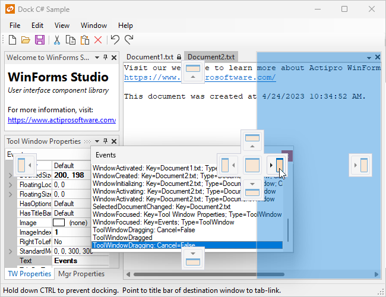

# Welcome

WinForms Studio is a bundled suite of professional user interface controls and components for Microsoft's Windows Forms (WinForms) framework.

## WinForms Control Products

### SyntaxEditor

[Actipro SyntaxEditor](syntaxeditor/index.md) is a powerful text editing control that is packed with features for efficient code editing, including syntax highlighting, line numbers, block selection, IntelliPrompt UI, code outlining, parsing, split views, zooming, bi-di support, and much more.  It has many of the same code editing features found in the Visual Studio code editor.

SyntaxEditor is built on top of our next-generation extensible text/parsing framework.  While over 20 free sample languages are available to get you started (such as C#, VB, XML, and more), custom language definitions can be developed and distributed with your applications as well.  SyntaxEditor is designed for use in IDE (integrated development environment) applications, however there are many other applications out there that can take advantage of such a control.

This free add-on is included with SyntaxEditor:

- [LL(*) Parser Framework](syntaxeditor/ll-parser-framework/index.md) - Easily build advanced parsers using EBNF-like notation

These optional premium add-ons for advanced syntax language implementations are shipped and demoed with the WinForms controls, but are sold separately:

- [.NET Languages Add-on](syntaxeditor/dotnet-languages-addon/index.md) - Advanced C# and Visual Basic
- [Python Language Add-on](syntaxeditor/python-language-addon/index.md) - Advanced Python
- [Web Languages Add-on](syntaxeditor/web-languages-addon/index.md) - Advanced XML, JavaScript, and JSON

### Bars

[Actipro Bars](bars/index.md) provides extensive bar user interface features similar to products like Visual Studio.  This includes dockable toolbars, standalone toolbars, popup menus, and statusbars.  The entire bar control system takes a different approach to design and implementation than other competitors.  The design of Actipro's bar controls is geared towards large applications, with a command / command link design pattern.  Several high-level features include: docking on any side of a host, multiple command link styles, layout save/restore, designer support, full run-time end-user customization support, a powerful keyboard shortcut model, application modes, multiple built-in rendering styles, programmatic control over the bar layout, and much more.

### Docking & MDI

[Actipro Docking & MDI](docking/index.md) provides all the latest functionality of docking tool windows and multiple styles of document MDI found in products like Visual Studio.  Ths includes features such as: tear-off tool windows that can be docked in nested hierarchies, dock guides, next window navigation, auto-hide, tool window inner-fill, layout save/restore, document windows, standard and tabbed MDI, multiple tab groups, designer support, multiple built-in rendering styles, a robust object model that gives you complete programmatic control over the dock layout, and much more.

The [TabStrip](docking/tabstrip/index.md) control included in this product provides a complete alternative to the standard TabControl found in the .NET framework.  The features of TabStrip include: alignment of tabs to any side, optional display of close and/or options buttons, several modes of tab overflow handling including one for smooth scrolling of tabs, drag/drop reordering of tabs, designer support, multiple built-in rendering styles, and much more.

### Wizard

[Actipro Wizard](wizard/index.md) is the premiere control for building wizard dialogs in WinForms that conform to the Wizard97 specifications.

Features include: multiple page types, easy page sequencing, selection change processing, full control over button states, page titles that update the containing form, theming, and much more.

### Navigation

[Actipro Navigation](navigation/index.md) provides the NavigationBar control which duplicates the functionality of the navigation bar first introduced in Outlook.  It has an elegant user interface which uses buttons to control which navigation pane is selected.  Features include: buttons with single-click access to each pane, an overflow chevron button providing access to customization features and hidden buttons, a ready-to-use Navigation Bar Options dialog, support for large and small images, a separate NavigationBarPanel control that can act as a container, designer support, multiple built-in rendering styles, and much more.

### Shared Library

The [Actipro Shared Library](shared/index.md) contains the base WinUICore framework used by our other WinForms control products, along with a drawing framework, and some helpful controls like owner-drawn menus, markup label, scrollbar, and a color picker.

The Shared Library components are free for use by any licensed customers of our WinForms control products.

## The WinForms Studio Bundle

WinForms Studio is a bundled suite of all Actipro's WinForms control products listed above.

While the WinForms Studio suite provides enormous **price discounts** over ordering all of our WinForms products separately, you are free to purchase licenses for individual WinForms control products if you don't require the entire suite.

## Sample Browser

The Sample Browser is the main sample project that ships with WinForms Controls.

It is an application with full source code that is designed to provide information, demos, and QuickStarts for all of Actipro's WinForms control products.  This source code is invaluable for learning how to use the various WinForms control products.

The Sample Browser project can be opened with Visual Studio.
