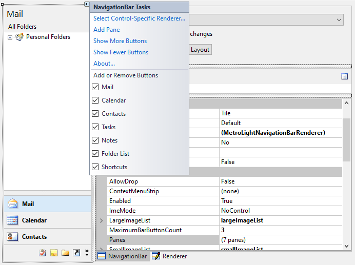

# Designer Support

[NavigationBar](xref:ActiproSoftware.UI.WinForms.Controls.Navigation.NavigationBar) provides rich design-time support, making it easy to configure the control in the Visual Studio designer.

> [!NOTE]
> See the [Visual Studio Designer](../visual-studio-designer.md) topic for details and requirements for designer functionality.

After you drop a [NavigationBar](xref:ActiproSoftware.UI.WinForms.Controls.Navigation.NavigationBar) control on a designer `Form` from the **Toolbox**, toggle the **Smart Tag** panel for a list of designer actions. The designer actions can also be accessed from the control's context menu.  The **Add Pane** action can be used to add a new [NavigationPane](xref:ActiproSoftware.UI.WinForms.Controls.Navigation.NavigationPane).  Alternatively, you may modify the [Panes](xref:ActiproSoftware.UI.WinForms.Controls.Navigation.NavigationBar.Panes) collection on the [NavigationBar](xref:ActiproSoftware.UI.WinForms.Controls.Navigation.NavigationBar) control to add/remove panes or reorder them.

*NavigationBar in the designer with Smart Tag panel displayed*

After one or more panes have been added to the control, child controls can be added to them.  The panes act like container controls.  Child controls may be docked within them or positioned without docking.  To make another pane visible, first click the [NavigationBar](xref:ActiproSoftware.UI.WinForms.Controls.Navigation.NavigationBar) to give it focus and then click on a pane's button to display it.  Alternatively, you can select a [NavigationPane](xref:ActiproSoftware.UI.WinForms.Controls.Navigation.NavigationPane) in the Visual Studio **Properties** window and the [NavigationBar](xref:ActiproSoftware.UI.WinForms.Controls.Navigation.NavigationBar) will display the newly selected pane.

Additional designer actions are available to control how many large pane buttons are visible and which panes are active by default.
