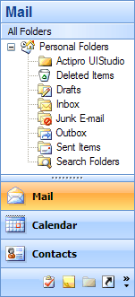
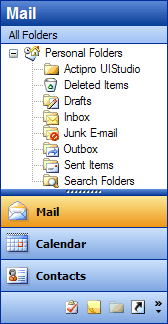
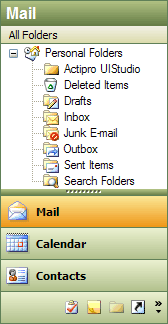
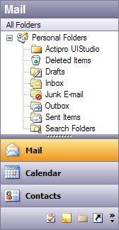
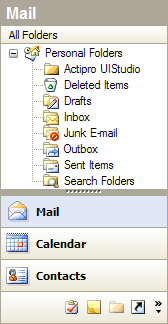
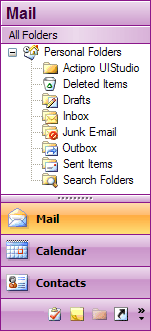

# Extensible Rendering

Both [NavigationBar](xref:@ActiproUIRoot.Controls.Navigation.NavigationBar) and [NavigationBarPanel](xref:@ActiproUIRoot.Controls.Navigation.NavigationBarPanel) use an extensible rendering model that is based on our common object model.  The object model centers around the use of a renderer class.  The renderer measures and draws all of the elements within the control.  This is a great design because it allows you to use our pre-defined renderers or create your own.

This object model allows for three levels of rendering customization.  Choose which level of customization you wish to use:

- Use Built-In Renderers As-Is - Use the built-in rendering styles without any changes, which include Metro Light, all Office 2007 styles (Blue, Silver, Black) and 2003 styles (Blue, Olive, Silver, and Windows Classic).

- Modify Properties on Built-In Renderers - Use the built-in renderers but modify the various properties on the renderers to easily create a customized appearance.

- Create Custom Renderers - Implement the [INavigationBarRenderer](xref:@ActiproUIRoot.Controls.Navigation.INavigationBarRenderer) interface or inherit our [NavigationBarRenderer](xref:@ActiproUIRoot.Controls.Navigation.NavigationBarRenderer) class to do all the measuring and drawing of the controls and their elements yourself.

These are some sample rendering styles that come with [NavigationBar](xref:@ActiproUIRoot.Controls.Navigation.NavigationBar):



## Use Built-In Renderers As-Is

Navigation includes the following built-in renderers:

| Renderer | Description |
|-----|-----|
| [MetroNavigationBarRenderer](xref:@ActiproUIRoot.Controls.Navigation.MetroNavigationBarRenderer) | Capable of drawing in a Metro style (Light and Dark).  To change to a different style, change the [BaseColorSchemeType](xref:@ActiproUIRoot.Controls.Navigation.Office2003NavigationBarRenderer.BaseColorSchemeType). |
| [Office2007NavigationBarRenderer](xref:@ActiproUIRoot.Controls.Navigation.Office2007NavigationBarRenderer) | Capable of drawing all Office 2007 styles (Blue, Silver, and Black).  To change to a different style, change the [BaseColorSchemeType](xref:@ActiproUIRoot.Controls.Navigation.Office2003NavigationBarRenderer.BaseColorSchemeType). |
| [Office2003NavigationBarRenderer](xref:@ActiproUIRoot.Controls.Navigation.Office2003NavigationBarRenderer) | Capable of drawing all Office 2003 styles (Blue, Olive, Silver, and Windows Classic).  To change to a different style, change the [BaseColorSchemeType](xref:@ActiproUIRoot.Controls.Navigation.Office2003NavigationBarRenderer.BaseColorSchemeType). |

## Color Tinting Color Schemes

With one line of code, any `WindowsColorScheme` can be tinted so that all of the colors are altered.  For instance, you can easily create a purple color scheme and then use those color schemes with the [Office2007NavigationBarRenderer](xref:@ActiproUIRoot.Controls.Navigation.Office2007NavigationBarRenderer) or [Office2003NavigationBarRenderer](xref:@ActiproUIRoot.Controls.Navigation.Office2003NavigationBarRenderer) classes like this:



This code shows how to load a custom purple-tinted color scheme (displayed in the screenshot above) that is based on the built-in Office 2007 blue theme:

```csharp
WindowsColorScheme scheme = new WindowsColorScheme("Purple", WindowsColorSchemeType.WindowsXPBlue, Color.Purple);
navigationBar.Renderer = new Office2007NavigationBarRenderer(scheme);
```

## Customizing Specific Colors in a Color Scheme

Each color property on the `WindowsColorScheme` class has a getter and setter.  This means that after a base color scheme is selected for use, you may alter specific colors as needed.

This code shows how change the background of menus to be `LightBlue` for the built-in Windows Classic color scheme.

```csharp
WindowsColorScheme.WindowsClassic.MenuBack = Color.LightBlue;
```

> [!NOTE]
> Any renderers created before the color settings were changed may need to be refreshed for the color changes to take effect in the renderer.

## Modify Properties on Built-In Renderers

Select a base built-in renderer to use by following the steps above.  Then use the designer to change its properties.  You can change fonts, colors, backgrounds, measuring parameters, etc.  Our built-in renderers give you a lot of options that you can use to customize the look and feel of the controls.

## Create Custom Renderers

For the most flexibility over what is measured and rendered, create a class that implements the [INavigationBarRenderer](xref:@ActiproUIRoot.Controls.Navigation.INavigationBarRenderer) interface.  Alternatively, you can create a class that inherits our [NavigationBarRenderer](xref:@ActiproUIRoot.Controls.Navigation.NavigationBarRenderer) or one of its descendants.  The renderer interface has methods that measure and draw the controls and their elements.

After your custom renderer class has been created, assign it to the [Renderer](xref:@ActiproUIRoot.Controls.Navigation.NavigationBar.Renderer) property of each [NavigationBar](xref:@ActiproUIRoot.Controls.Navigation.NavigationBar) or [NavigationBarPanel](xref:@ActiproUIRoot.Controls.Navigation.NavigationBarPanel) that should use it for drawing.

## Customizing Individual Navigation Panes

Renderer settings affect the rendering of all the controls that use the renderer.  However there are other properties on each [NavigationPane](xref:@ActiproUIRoot.Controls.Navigation.NavigationPane) that allow for customization of that particular instance.  These are the properties that can be used to customize a specific pane:

| Member | Description |
|-----|-----|
| [BackgroundFill](xref:@ActiproUIRoot.Controls.Navigation.NavigationPane.BackgroundFill) Property | Gets or sets the pane-specific `BackgroundFill` for the navigation pane. |
| [ButtonBackgroundFill](xref:@ActiproUIRoot.Controls.Navigation.NavigationPane.ButtonBackgroundFill) Property | Gets or sets the pane-specific `BackgroundFill` for a navigation pane button. |
| [ButtonDisabledForeColor](xref:@ActiproUIRoot.Controls.Navigation.NavigationPane.ButtonDisabledForeColor) Property | Gets or sets the pane-specific foreground color of a disabled navigation pane button. |
| [ButtonFont](xref:@ActiproUIRoot.Controls.Navigation.NavigationPane.ButtonFont) Property | Gets or sets the pane-specific `Font` to use when drawing a navigation pane button. |
| [ButtonForeColor](xref:@ActiproUIRoot.Controls.Navigation.NavigationPane.ButtonForeColor) Property | Gets or sets the pane-specific foreground color of a navigation pane button. |
| [ButtonHotBackgroundFill](xref:@ActiproUIRoot.Controls.Navigation.NavigationPane.ButtonHotBackgroundFill) Property | Gets or sets the pane-specific `BackgroundFill` for a navigation pane button in a hot state. |
| [ButtonHotPressedBackgroundFill](xref:@ActiproUIRoot.Controls.Navigation.NavigationPane.ButtonHotPressedBackgroundFill) Property | Gets or sets the pane-specific `BackgroundFill` for a navigation pane button in a hot/pressed state. |
| [ButtonPressedBackgroundFill](xref:@ActiproUIRoot.Controls.Navigation.NavigationPane.ButtonPressedBackgroundFill) Property | Gets or sets the pane-specific `BackgroundFill` for a navigation pane button in a pressed state. |
