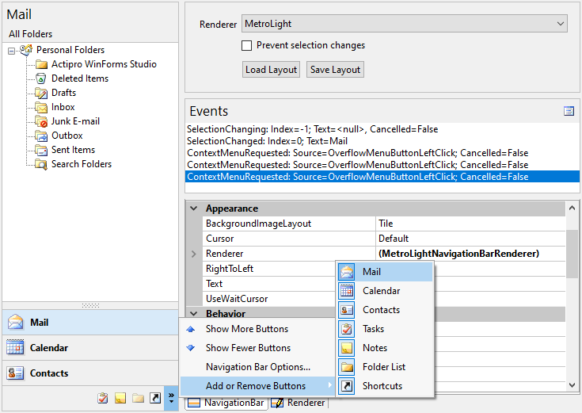
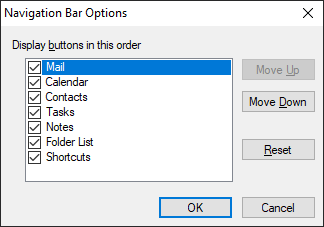

# Overview

[NavigationBar](xref:@ActiproUIRoot.Controls.Navigation.NavigationBar) provides a concept for navigating through different panes of data that was first introduced in Outlook 2003.  It has an elegant user interface which uses buttons to control which navigation pane is selected.  Panes can display data or simply act as a container for child controls.

If screen real estate is available, large buttons can be used for pane selection.  The end-user has the option of using a splitter to move the large buttons into the overflow button tray, which uses smaller buttons.  If not all of the buttons can fit in that tray, they flow out into the overflow menu, accessible by the chevron button.

*NavigationBar with overflow menu displayed*

Further, the end-user can customize the order of the buttons and which ones are displayed by using the built-in [Navigation Bar Options](options-dialog.md) dialog.

*Navigation Bar Options dialog*

The [NavigationBar](xref:@ActiproUIRoot.Controls.Navigation.NavigationBar) control has full [Visual Studio designer support](designer-support.md).  As pane buttons are clicked or panes selected in the Visual Studio **Properties** window, the control updates to show the pane and its contents.  The pane acts as a container control and can be used to host any type of child control.

[NavigationBar](xref:@ActiproUIRoot.Controls.Navigation.NavigationBar) includes a separate [NavigationBarPanel](navigationbar-panel.md) control that can be used to complement the [NavigationBar](xref:@ActiproUIRoot.Controls.Navigation.NavigationBar) by providing a container with three different header rendering styles.

## Feature List

- Complete implementation of Navigation Bar functionality found in Outlook.
- Built-in [rendering styles](extensible-rendering.md).  include Metro Light and all Office 2007/2003 styles - Black, Blue, Olive, Silver, and Windows Classic.
- Robust rendering interface allows for totally [customized rendering](extensible-rendering.md).
- [Buttons](run-time-usage.md) provide single-click access to each pane.
- Buttons can be collapsed to an overflow area, allowing for more client area real estate.
- Overflow chevron button provides access to customization features and hidden buttons.
- Built-in [Navigation Bar Options](options-dialog.md) dialog for reordering buttons and controlling which buttons are visible.
- Support for large and small image sizes.
- Ability to disable specific buttons.
- Default context menus may be cancelled so custom [context menus](context-menus.md) can be displayed.
- Ability to [cancel selected pane changes](pane-selection.md).
- Full [designer support](designer-support.md).
- A separate [NavigationBarPanel](navigationbar-panel.md) control that can act as a container and renders in three modes (normal, header, and sub-header modes).
