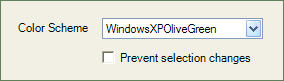
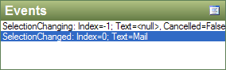
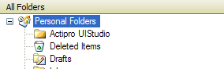

# NavigationBarPanel

Navigation includes a [NavigationBarPanel](xref:@ActiproUIRoot.Controls.Navigation.NavigationBarPanel) control that can be used to complement a [NavigationBar](xref:@ActiproUIRoot.Controls.Navigation.NavigationBar).

## Styles

The [NavigationBarPanel](xref:@ActiproUIRoot.Controls.Navigation.NavigationBarPanel) control provides a `Panel` control container that can render in three different styles, corresponding to various styles found in Microsoft Office.

### Normal

Renders a simple panel with a border.

### Header

Renders a panel with a large header, similar to the header found in a [NavigationBar](xref:@ActiproUIRoot.Controls.Navigation.NavigationBar) control.

### SubHeader

Renders a sub-header that can be used within another panel.

## Changing Rendering Styles

The rendering styles are represented by the [NavigationBarPanelStyle](xref:@ActiproUIRoot.Controls.Navigation.NavigationBarPanelStyle) enumeration.  To change the rendering style of a [NavigationBarPanel](xref:@ActiproUIRoot.Controls.Navigation.NavigationBarPanel) control, set the [Style](xref:@ActiproUIRoot.Controls.Navigation.NavigationBarPanel.Style) property.

Additionally, the [Renderer](xref:@ActiproUIRoot.Controls.Navigation.NavigationBarPanel.Renderer) property can be set to provide a custom renderer.
