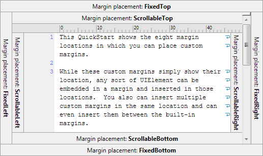

# Editor View Margins

While the SyntaxEditor editor views have numerous built-in margins (line number, outlining, etc.), SyntaxEditor offers an extensibility point where custom margins can be created and added to editor views in any location.

Editor view margins all implement the [IEditorViewMargin](xref:ActiproSoftware.UI.WinForms.Controls.SyntaxEditor.Margins.IEditorViewMargin) interface.

## Margin Locations

Editor view margins surround the text area and fall into two categories: scrollable or fixed.

Scrollable margins appear inside of the scrollbars and scroll with the text area as it is scrolled.  Fixed margins appear outside of the scrollbars and do not scroll when the text area is scrolled.

*Custom margins that show the eight available margin placement locations*

All in all there are eight available margin placement locations.  The screenshot above shows where each placement is located.

The [IEditorViewMargin](xref:ActiproSoftware.UI.WinForms.Controls.SyntaxEditor.Margins.IEditorViewMargin).[Placement](xref:ActiproSoftware.UI.WinForms.Controls.SyntaxEditor.Margins.IEditorViewMargin.Placement) property has an [EditorViewMarginPlacement](xref:ActiproSoftware.UI.WinForms.Controls.SyntaxEditor.Margins.EditorViewMarginPlacement) enumeration value that indicates one of those eight placement locations.

Since each [IEditorViewMargin](xref:ActiproSoftware.UI.WinForms.Controls.SyntaxEditor.Margins.IEditorViewMargin) has a string-based `Key`, and the interface also implements [IOrderable](xref:ActiproSoftware.Text.Utility.IOrderable), it has an [Orderings](xref:ActiproSoftware.Text.Utility.IOrderable.Orderings) property that returns an enumerable of [Ordering](xref:ActiproSoftware.Text.Utility.Ordering) objects.  Each ordering indicates the a string `Key` of another margin and whether this margin comes before or after that one.  When multiple margins are combined into a placement location, they are ordered based on the [Orderings](xref:ActiproSoftware.Text.Utility.IOrderable.Orderings) property values, where "after" means farther away from the text area.

For instance, the selection margin says it is not after anything, meaning it is placed closes to the text area.  The line number margin says it is after the selection margin, and so on.

## Built-In Margin Summary

These editor view margins are built-in to the product:

- Indicator margin
- Line number margin
- Selection margin
- Outlining margin
- Word wrap glyph margin
- Ruler margin

All of the built-in margins are scrollable margins, meaning they scroll with the text area.

## Indicator Margin

The indicator margin, implemented by the [EditorIndicatorMargin](xref:ActiproSoftware.UI.WinForms.Controls.SyntaxEditor.Primitives.EditorIndicatorMargin) class, is used to display glyphs for indicators.  It appears in the scrollable left placement.

### Visibility

This margin is not visible by default, and can be made visible when the [SyntaxEditor](xref:ActiproSoftware.UI.WinForms.Controls.SyntaxEditor.SyntaxEditor).[IsIndicatorMarginVisible](xref:ActiproSoftware.UI.WinForms.Controls.SyntaxEditor.SyntaxEditor.IsIndicatorMarginVisible) property is `true`.

## Line Number Margin

The line number margin, implemented by the [EditorLineNumberMargin](xref:ActiproSoftware.UI.WinForms.Controls.SyntaxEditor.Primitives.EditorLineNumberMargin) class, is used to display snapshot line numbers.  It appears in the scrollable left placement.

Word wrapped lines do not display any line numbers.

### Visibility

This margin is not visible by default, and can be made visible when the [SyntaxEditor](xref:ActiproSoftware.UI.WinForms.Controls.SyntaxEditor.SyntaxEditor).[IsLineNumberMarginVisible](xref:ActiproSoftware.UI.WinForms.Controls.SyntaxEditor.SyntaxEditor.IsLineNumberMarginVisible) property is `true`.

### Customizing Line Numbers

The origin line number that defaults to `1` can be set via the [IEditorDocument](xref:ActiproSoftware.Text.IEditorDocument).[LineNumberOrigin](xref:ActiproSoftware.Text.IEditorDocument.LineNumberOrigin) property.  Beyond that, an [ITextViewLineNumberProvider](xref:ActiproSoftware.UI.WinForms.Controls.SyntaxEditor.ITextViewLineNumberProvider) service can be registered on the syntax language to customize how numbers are rendered in the line number margin if one-based integer numbers are not desired.

See the [Line Number Provider](../../language-creation/feature-services/line-number-provider.md) topic for more information on implementing this kind of language service.

## Selection Margin

The selection margin, implemented by the [EditorSelectionMargin](xref:ActiproSoftware.UI.WinForms.Controls.SyntaxEditor.Primitives.EditorSelectionMargin) class, is used to display line modification marks and to provide an easy way to make line-based selections.  It appears in the scrollable left placement.

### Visibility

This margin is visible by default, and can be made invisible when the [SyntaxEditor](xref:ActiproSoftware.UI.WinForms.Controls.SyntaxEditor.SyntaxEditor).[IsSelectionMarginVisible](xref:ActiproSoftware.UI.WinForms.Controls.SyntaxEditor.SyntaxEditor.IsSelectionMarginVisible) property is `false`.

## Outlining Margin

The outlining margin, implemented by the [EditorOutliningMargin](xref:ActiproSoftware.UI.WinForms.Controls.SyntaxEditor.Primitives.EditorOutliningMargin) class, is used to display the code outlining (folding) node tree, also enables the end user to easily expand and collapse nodes.  It appears in the scrollable left placement.

### Visibility

This margin is visible by default, and can be made invisible when the [SyntaxEditor](xref:ActiproSoftware.UI.WinForms.Controls.SyntaxEditor.SyntaxEditor).[IsOutliningMarginVisible](xref:ActiproSoftware.UI.WinForms.Controls.SyntaxEditor.SyntaxEditor.IsOutliningMarginVisible) property is `false`.

## Word Wrap Glyph Margin

The word wrap glyph margin, implemented by the [EditorWordWrapGlyphMargin](xref:ActiproSoftware.UI.WinForms.Controls.SyntaxEditor.Primitives.EditorWordWrapGlyphMargin) class, is used to display glyphs at the end of lines that are too long to fit in the view and must be wrapped.  It appears in the scrollable right placement.

### Visibility

This margin is not visible by default, and can be made visible when the [SyntaxEditor](xref:ActiproSoftware.UI.WinForms.Controls.SyntaxEditor.SyntaxEditor).[AreWordWrapGlyphsVisible](xref:ActiproSoftware.UI.WinForms.Controls.SyntaxEditor.SyntaxEditor.AreWordWrapGlyphsVisible) property is `true`.  The editor must also be in word wrap mode for this margin to be visible.

## Ruler Margin

The ruler margin, implemented by the [EditorRulerMargin](xref:ActiproSoftware.UI.WinForms.Controls.SyntaxEditor.Primitives.EditorRulerMargin) class, is used to display a ruler character for code that uses fixed-width fonts.  It appears in the scrollable top placement.

### Visibility

This margin is not visible by default, and can be made visible when the [SyntaxEditor](xref:ActiproSoftware.UI.WinForms.Controls.SyntaxEditor.SyntaxEditor).[IsRulerMarginVisible](xref:ActiproSoftware.UI.WinForms.Controls.SyntaxEditor.SyntaxEditor.IsRulerMarginVisible) property is `true`.

## Margin Factories

Margin factories are used to tell SyntaxEditor which margins to display in an editor view.  Margin factories are implementations of the [IEditorViewMarginFactory](xref:ActiproSoftware.UI.WinForms.Controls.SyntaxEditor.Margins.IEditorViewMarginFactory) interface.

The [DefaultEditorViewMarginFactory](xref:ActiproSoftware.UI.WinForms.Controls.SyntaxEditor.Margins.Implementation.DefaultEditorViewMarginFactory) class is an implementation of a factory that creates all of the built-in margins.  While all the built-in margins are added if this factory is used, they still change their visibility based on the related SyntaxEditor margin visibility properties such as [IsLineNumberMarginVisible](xref:ActiproSoftware.UI.WinForms.Controls.SyntaxEditor.SyntaxEditor.IsLineNumberMarginVisible).

The [SyntaxEditor](xref:ActiproSoftware.UI.WinForms.Controls.SyntaxEditor.SyntaxEditor).[ViewMarginFactories](xref:ActiproSoftware.UI.WinForms.Controls.SyntaxEditor.SyntaxEditor.ViewMarginFactories) property is a collection of [IEditorViewMarginFactory](xref:ActiproSoftware.UI.WinForms.Controls.SyntaxEditor.Margins.IEditorViewMarginFactory) objects.  By default it is auto-populated with the [DefaultEditorViewMarginFactory](xref:ActiproSoftware.UI.WinForms.Controls.SyntaxEditor.Margins.Implementation.DefaultEditorViewMarginFactory), meaning all built-in margins are available.  Add additional margin factories to the collection if you wish to add custom margins.  A QuickStart is available in the samples that shows how to do this.

## Custom Margins

Custom margins are pretty easy to create.  These are the basic steps involved:

- First, make a margin `Control` that implements [IEditorViewMargin](xref:ActiproSoftware.UI.WinForms.Controls.SyntaxEditor.Margins.IEditorViewMargin).
- Second, make a custom [IEditorViewMarginFactory](xref:ActiproSoftware.UI.WinForms.Controls.SyntaxEditor.Margins.IEditorViewMarginFactory) that creates an instance of your margin class.
- Third, add your custom margin factory to the [SyntaxEditor](xref:ActiproSoftware.UI.WinForms.Controls.SyntaxEditor.SyntaxEditor).[ViewMarginFactories](xref:ActiproSoftware.UI.WinForms.Controls.SyntaxEditor.SyntaxEditor.ViewMarginFactories) collection.

At this point your margin should now be getting added to the view.  Scrollable margins need to update when the text area is changed, so be sure to attach to the view's [TextAreaLayout](xref:ActiproSoftware.UI.WinForms.Controls.SyntaxEditor.ITextView.TextAreaLayout) event and update the margin properly when that event fires.

For details on implementing a custom margin including several complete examples, please see the related QuickStarts in the samples.
