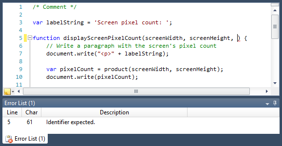

# Overview

The advanced JavaScript syntax language implementation in the SyntaxEditor Web Languages Add-on includes everything from code outlining to syntax error reporting.

## Features

The JavaScript language is packed with features, including:

- Automated IntelliPrompt completion list.
- Syntax highlighting.
- Abstract syntax tree (AST) generation.
- Over 45 distinct AST node classes.
- Automatic code outlining based on AST structure.
- Reporting and automatic squiggle display of errors for invalid syntax.
- Mouse hover quick info for syntax errors.
- Line commenting.
- Smart indent.
- Text formatting.
- Code block selection.
- Delimiter (bracket) highlighting and auto-completion.
- Code fragment editing with full IntelliPrompt, such as editing a function body.
- Optionally change the parser to parse expressions, statements, etc. instead of compilation units.

## Licensing

Even though the Web Languages Add-on is distributed and demoed with the WinForms controls, it is optional and is sold separately from SyntaxEditor and any containing bundles.  The pricing on the add-on is very cheap and licenses are all Enterprise licenses, meaning they cover your entire organization.

See the [Assemblies and Add-on Licensing](../../assemblies.md) topic for more information.

## Getting Started

This topic covers how to get started using the JavaScript language from the Web Languages Add-on, implemented by the [JavaScriptSyntaxLanguage](xref:ActiproSoftware.Text.Languages.JavaScript.Implementation.JavaScriptSyntaxLanguage) class, and lists its requirements for supporting advanced features like parsing and automated IntelliPrompt.

It is very important to follow the steps in this topic to configure the language correctly so that its advanced features operate as expected.

See the [Getting Started](getting-started.md) topic for more information.

## Parsing and Parse Data

The JavaScript language uses an advanced parser that has been constructed using the Actipro [LL(*) Parser Framework](../../ll-parser-framework/index.md), and provides functionality for building ASTs, reporting parse errors, and more.

The [ILLParseData](xref:ActiproSoftware.Text.Parsing.LLParser.ILLParseData) results returned by this parser are consumed by multiple other features of the language, such as code outlining, parse error display, etc.

See the [Parsing and Parse Data](parsing.md) topic for more information.

## Indent Provider

An indent provider enables support for smart indent features when pressing ENTER.

See the [Indent Provider](indent-provider.md) topic for more information.

## Text Formatter

The built-in text formatter can adjust whitespace between code elements to make code more readable.

See the [Text Formatter](text-formatter.md) topic for more information.

## Automated IntelliPrompt

The JavaScript language has built-in automated IntelliPrompt completion list features that greatly enhance the end user's editing experience.

See the [Automated IntelliPrompt](intelliprompt.md) topic for more information.
