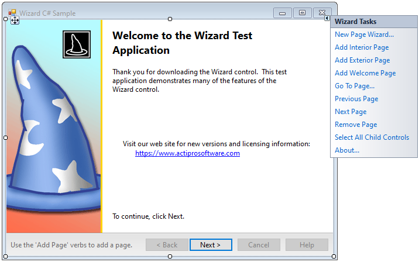
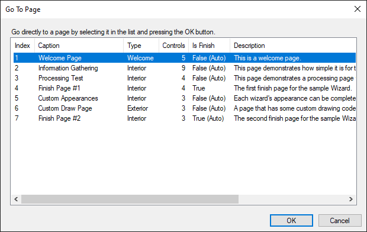

# Design-Time Functionality

Wizard has a lot of designer functionality.  In the designer, you can add/remove pages, configure each wizard page and the child controls on it, and even change the appearance of the wizard and its pages.

> [!NOTE]
> See the [Visual Studio Designer](../visual-studio-designer.md) topic for details and requirements for designer functionality.

## Adding and Configuring Pages

Pages represent each step in the wizard.  To add a page while in the designer, right-click on the [Wizard](xref:@ActiproUIRoot.Controls.Wizard.Wizard) control and select either the **Add Interior Page**, **Add Exterior Page**, or **Add Welcome Page** actions.

For interior pages, it is important to set the [PageCaption](xref:@ActiproUIRoot.Controls.Wizard.WizardPage.PageCaption) and [PageDescription](xref:@ActiproUIRoot.Controls.Wizard.WizardPage.PageDescription) properties.  These control the text that is set in the interior page header.  If you are inheriting from a [WizardDialogForm](xref:@ActiproUIRoot.Controls.Wizard.WizardDialogForm), you can set the [PageTitleBarText](xref:@ActiproUIRoot.Controls.Wizard.WizardPage.PageTitleBarText) property to control what text is automatically set in the title bar of the `Form`.

For welcome pages, it is important to set the [WatermarkBackgroundFill](xref:@ActiproUIRoot.Controls.Wizard.WizardWelcomePage.WatermarkBackgroundFill), [WatermarkImage](xref:@ActiproUIRoot.Controls.Wizard.WizardWelcomePage.WatermarkImage), and [WatermarkWidth](xref:@ActiproUIRoot.Controls.Wizard.WizardWelcomePage.WatermarkWidth) properties.

## Navigating through Pages at Design-Time

To move through pages at design time, you can do one of several things:

- Click on the **Next** and **Back** buttons on the wizard.
- Use the **Next Page** and **Previous Page** designer actions.
- Select the desired page in the Visual Studio **Properties** window.
- Use the **Go To Page...** designer action to open the **Go To Page** dialog and navigate directly to a page.
- Double-click the [Wizard](xref:@ActiproUIRoot.Controls.Wizard.Wizard) or a [WizardPage](xref:@ActiproUIRoot.Controls.Wizard.WizardPage) to open the **Go To Page** dialog and navigate directly to a page.

## Using the Go To Page Dialog

The **Go To Page** dialog provides the best method for navigating directly to a page while in the designer.  Access it by using the **Go To Page...** designer action or simply by double-clicking on the [Wizard](xref:@ActiproUIRoot.Controls.Wizard.Wizard) or a [WizardPage](xref:@ActiproUIRoot.Controls.Wizard.WizardPage) control while in the designer.  The dialog provides useful information about each page.  By default, the current page is selected in the list.  To navigate to a specific page, select it in the list and click the **OK** button.

## Reordering Pages

To change the default sequence in which pages appear:

1. Select the [Wizard](xref:@ActiproUIRoot.Controls.Wizard.Wizard) control in the Visual Studio designer.
1. Using the **Properties** window, open the collection editor for the [Pages](xref:@ActiproUIRoot.Controls.Wizard.Wizard.Pages) property.
1. The collection editor has buttons to move a page up or down within the collection, thus changing the sequence.
