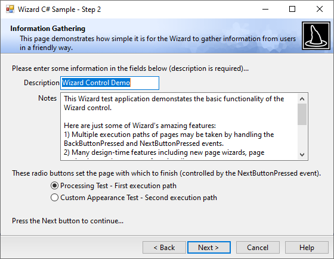

# Overview

Wizards are one of the best ways to simplify the user experience of applications.  They allow developers to take complex operations and break them up into a series of simple steps.  Each step is customized to a specific task and provides specialized explanations and controls for that task.

From a design perspective, wizards are similar to property sheets in that they hold a collection of pages that are displayed one at a time.  However instead of using tabstrips to navigate through pages, **Next** and **Back** buttons are used.  Wizards contain a number of pages, each page representing a step in the wizard.  The problem is that Windows Forms provides no easy way to design wizards, that is, until now.

Actipro Software's [Wizard](xref:ActiproSoftware.UI.WinForms.Controls.Wizard.Wizard) control provides a powerful framework for developing wizards that follow the Wizard97 specifications.

Its design-time features allow you to visually design your wizard.  At design-time you can manage all the pages in the wizard, navigate through the pages, and lay out each page's child controls.  The user interface of the wizard can be completely customized and is reflected in the Visual Studio designer.

At run-time, the wizard automatically manages stepping through the wizard pages and controls the button enabled states.  You can override this default behavior to programmatically control the flow of the wizard steps or control the button enabled states.

## Feature List

- Adheres to the Wizard97 specification.
- Create interior pages, with header pre-generated.
- Create exterior pages that fill the wizard client area.
- Create welcome pages using pre-defined templates.
- Easily design wizard pages in the Visual Studio designer.
- Navigate through pages at design-time by clicking on the **Next** and **Back** buttons or by using designer actions.
- Use the **Go To Page** dialog to navigate directly to any page at design-time.
- Add or remove pages using designer actions.
- Use the **New Page Wizard** to easily create new pages.
  
  - Templates for configuration of blank interior, exterior, and welcome pages.
  - Templates for customer information pages.
  - Templates for radio button selection pages.
- Manage and reorder the pages by editing the [Wizard](xref:ActiproSoftware.UI.WinForms.Controls.Wizard.Wizard).[Pages](xref:ActiproSoftware.UI.WinForms.Controls.Wizard.Wizard.Pages) collection in the Visual Studio **Properties** window.
- Automatically handles wizard page step flow and manages button enabled states.
- Two types of page sequencing.
- Programmatically override the flow of the wizard page steps and button enable states.
- Perform validation before pages are changed and cancel page switching if data entry on a page is not complete.
- Disable or hide buttons while performing processing tasks.
- Inherit from the `WizardDialogForm` which provides a `Form` with a built-in [Wizard](xref:ActiproSoftware.UI.WinForms.Controls.Wizard.Wizard) control.
- Resizes with parent `Form`.
- Sets the accept and cancel buttons on the container `Form` to wizard buttons.
- Powerful localization support including the ability to set different fonts, text, button widths, etc. for each language.
- Handle events at the general `Wizard` level or at the `WizardPage`-specific level.
- Extremely customizable user interface properties.
- Show the **Finish** button in the same space as the **Next** button or separately.
- Optionally align the **Help** button to the left side of the wizard.
- Control the flat styles of buttons and handle hot-tracking events to set their `BackColor`.
- Uses a renderer class to draw all elements of the wizard; the renderer can be overridden for complete custom draw.
- Global renderer appearance property defaults that can be overridden for each page.
- Interior page guide lines to assist in positioning child controls.
- Uses the Actipro presentation layer framework.
