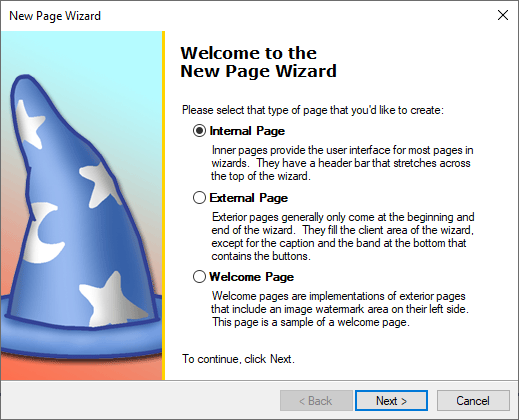
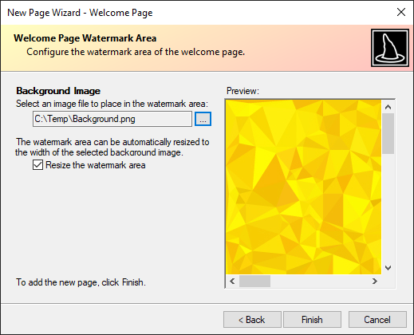

# Using the New Page Wizard

A **New Page Wizard** is provided to aid in creating new wizard pages.  To access the **New Page Wizard**:

1. Right-click the [Wizard](xref:@ActiproUIRoot.Controls.Wizard.Wizard) control in the Visual Studio designer to open its context menu, or select the control and show the **Smart Tag** panel.
1. Select the **New Page Wizard...** action from the context menu or **Smart Tag** panel.

## Choosing a Page Type

The first page in the **New Page Wizard** allows you to choose which type of page (internal, external, or welcome) to create.  If **External Page** is selected, clicking the **Finish** button will simply close the wizard and create a blank, external page. Selecting **Internal Page** or **Welcome Page** will present additional optional after clicking the **Next** button, and those options are discussed below for each page type.

## Internal Page Customization

When **Internal Page** is selected, the second wizard step allow you select the type of template to use for the new internal page.  All controls that are created by templates can be completely customized or removed.  Regardless of which template is chosen, a wizard step is provided to customize the caption, description, and title bar text of the page.

The customer information template creates labels and textboxes for a user name, organization, and serial number.

The radio button selection template creates a set of three bolded radio buttons with description labels below each option.

## Welcome Page Customization

When **Welcome Page** is selected, the second wizard step allows you to enter the information that will be displayed in the various labels that are placed in the welcome page.

The third wizard step allows you to browse for an image file to place in the background of the welcome page watermark area.  A checkbox is provided, designating whether the width of the watermark area should automatically resize to the width of the background image.

