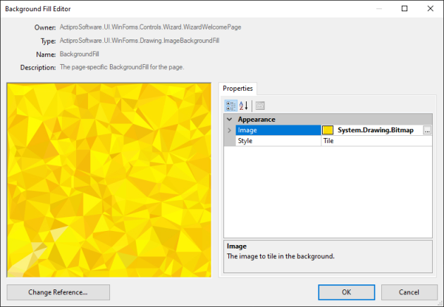

# Working with Background Fills

Background fills are part of the powerful Actipro Shared user interface library.  They can draw solid color, gradient, image-tiled, and other backgrounds.  They are extremely easy to set up while in design mode.

Wizard pages and wizard renderers both have a number of properties that use the `BackgroundFill` type.  The background fills on renderers generally apply as global defaults, while those on wizard pages are generally page-specific overrides.  Look how a single page changes appearance simply by changing background fills:


## Changing Background Fills


To change a background fill:

1. In the Visual Studio **Properties** window, select any `BackgroundFill` property.
1. Click the **...** button to open the **Background Fill Editor** dialog.


Using the **Properties** of the **Background Fill Editor** dialog, you can change the values of the current background fill and see exactly how the changes affect the fill by looking at the **Preview** on the left side of the window.

If you would like a completely different type of background fill:

1. Click the **Change Reference...** button to display a menu of options.
1. Select any type of background fill from the menu to change the fill to an instance of that type.


When selecting `ImageBackgroundFill`, the **Preview** will show a large red "X" until an image is defined. To set the image:

1. Select the `Image` property in the **Properties** of the **Background Fill Editor** dialog.
1. Click the **...** button to browse for an image file.
1. Once selected, the **Preview** will update to show the loaded image.



Once you are satisfied with the background fill, click the **OK** button to close the dialog or the **Cancel** button to restore the original settings.

## Custom Background Fills

You can create custom background fills and apply them to your wizard.  Doing this enables your wizard to take on a very complex and original appearance.  For instance, a wizard page could be made to have the original Windows XP look and feel.


The above background fill was created by using the following code that is included with the sample projects:

```csharp
using System;
using System.Drawing;
using ActiproSoftware.UI.WinForms.Drawing;

namespace TestApplication {

	/// <summary>
	/// Provides a base class for an object that can be used as a background fill.
	/// </summary>
	public class WindowsXPBackgroundFill : BackgroundFill {

		/// <summary>
		/// Creates an exact duplicate of the <see cref="BackgroundFill"/> object.
		/// </summary>
		/// <returns>An exact duplicate of the <see cref="BackgroundFill"/> object.</returns>
		public override BackgroundFill Clone() {
			return new WindowsXPBackgroundFill();
		}

		/// <summary>
		/// Fills an area with the background fill.
		/// </summary>
		/// <param name="g">The <c>Graphics</c> object used to paint.</param>
		/// <param name="bounds">The bounds of the area to paint.</param>
		/// <param name="brushBounds">The reference bounds for the brush.</param>
		/// <param name="side">The side with which the background fill should be oriented.</param>
		public override void Draw(Graphics g, Rectangle bounds, Rectangle brushBounds, Sides side) {
			// Fill in the background
			SolidColorBackgroundFill.Draw(g, brushBounds, Color.CornflowerBlue);

			// Draw a gradient circle
			EllipseGradient.Draw(g, new Rectangle(-100, -125, 300, 300), new Rectangle(-100, -125, 300, 300),
				Color.FromArgb(192, 224, 242), Color.CornflowerBlue, Color.CornflowerBlue);

			// Draw a separator
			Rectangle separatorBounds = new Rectangle(brushBounds.Left, brushBounds.Bottom - 75,
				brushBounds.Width, 2);
			TwoColorLinearGradient.Draw(g, separatorBounds, separatorBounds, Color.FromKnownColor(KnownColor.CornflowerBlue), 
				Color.FromArgb(192, 224, 242), 0, TwoColorLinearGradientStyle.SigmaBellBump, 0.5f, 1);

			// Fill in a rectangle
			SolidColorBackgroundFill.Draw(g, new Rectangle(separatorBounds.Left, separatorBounds.Bottom, 
				separatorBounds.Width, brushBounds.Height - separatorBounds.Bottom), Color.RoyalBlue);
		}
	}
}

```
