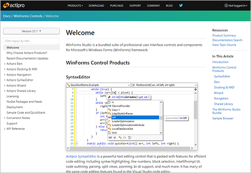

# Actipro WinForms Controls

 
 

Samples and documentation for [Actipro WinForms Controls](https://www.actiprosoftware.com/products/controls/windowsforms), a set of UI controls for building WinForms desktop applications.

## Table of Contents

- [About WinForms Controls](#about-winforms-controls)
- [Getting Started](#getting-started)
  - [Running the Sample Browser Application](#running-the-sample-browser-application)
  - [Browsing Documentation](#browsing-documentation)
  - [Running Other Sample Applications](#running-other-sample-applications)
  - [Viewing Related Open-Source Projects](#viewing-related-open-source-projects)
- [NuGet Packages](#nuget-packages)
- [Supported Technologies](#supported-technologies)
- [Contributing](#contributing)
- [Support](#support)
- [Licensing](#licensing)

## About WinForms Controls

The [Actipro WinForms Controls](https://www.actiprosoftware.com/products/controls/windowsforms) include:

- **SyntaxEditor** - A syntax-highlighting code editor control and parsing suite.
- **Docking/MDI** - A complete docking tool window and multiple document interface solution.
- **Bars** - Advanced, customizable docking toolbars, menus, and statusbars.
- **Navigation** - An Outlook-like navigation bar control with multiple panes.
- **Wizard** - Everything you need to quickly create wizard dialogs.
- **Shared Library** - A set of common controls and useful components for WinForms applications.

*The control products themselves are closed-source commercial products, whose source is not included in this repo.*

## Getting Started

### Running the Sample Browser Application

The Sample Browser application allows you to examine all of the Actipro WinForms controls and their feature sets via over 100 included demos and QuickStarts.

Follow these steps to run the application:

- Check out the repo.
- Open the `Samples\SampleBrowser\SampleBrowser.sln` solution in Visual Studio.
- Build and run the solution's application project.

### Browsing Documentation

Complete [product documentation](https://www.actiprosoftware.com/docs/controls/winforms/index) is available on our web site.

The Markdown source code for the product documentation is contained within this repo's `Documentation\topics` folder.  The documentation is built with [DocFx](https://github.com/dotnet/docfx). 

## NuGet Packages

[Packages for the Actipro WinForms Controls](https://www.nuget.org/packages?q=ActiproSoftware.Controls.WinForms) are published on nuget.org, all beginning with the `ActiproSoftware.Controls.WinForms` name prefix.

### All WinForms Controls Metapackage

This metapackage contains all of the control products, and is easiest to reference when getting started:

- [ActiproSoftware.Controls.WinForms](https://www.nuget.org/packages/ActiproSoftware.Controls.WinForms)

### Individual WinForms Control Packages

Use these individual control packages if you want to use a specific subset of the metapackage:

- [ActiproSoftware.Controls.WinForms.Bars](https://www.nuget.org/packages/ActiproSoftware.Controls.WinForms.Bars)
- [ActiproSoftware.Controls.WinForms.Docking](https://www.nuget.org/packages/ActiproSoftware.Controls.WinForms.Docking)
- [ActiproSoftware.Controls.WinForms.Navigation](https://www.nuget.org/packages/ActiproSoftware.Controls.WinForms.Navigation)
- [ActiproSoftware.Controls.WinForms.Shared](https://www.nuget.org/packages/ActiproSoftware.Controls.WinForms.Shared)
- [ActiproSoftware.Controls.WinForms.SyntaxEditor](https://www.nuget.org/packages/ActiproSoftware.Controls.WinForms.SyntaxEditor)
- [ActiproSoftware.Controls.WinForms.Wizard](https://www.nuget.org/packages/ActiproSoftware.Controls.WinForms.Wizard)

### SyntaxEditor Language Add-on Packages

Use these packages for SyntaxEditor's premium language add-ons as needed, which are shipped separately from the metapackage:

- [ActiproSoftware.Controls.WinForms.SyntaxEditor.Addons.DotNet](https://www.nuget.org/packages/ActiproSoftware.Controls.WinForms.SyntaxEditor.Addons.DotNet) - Advanced C#/VB languages in the .NET Languages Add-on.
- [ActiproSoftware.Controls.WinForms.SyntaxEditor.Addons.JavaScript](https://www.nuget.org/packages/ActiproSoftware.Controls.WinForms.SyntaxEditor.Addons.JavaScript) - Advanced JavaScript/JSON languages in the Web Languages Add-on.
- [ActiproSoftware.Controls.WinForms.SyntaxEditor.Addons.Python](https://www.nuget.org/packages/ActiproSoftware.Controls.WinForms.SyntaxEditor.Addons.Python) - Advanced Python language in the Python Language Add-on.
- [ActiproSoftware.Controls.WinForms.SyntaxEditor.Addons.XML](https://www.nuget.org/packages/ActiproSoftware.Controls.WinForms.SyntaxEditor.Addons.XML) - Advanced XML language in the Web Languages Add-on.

## Supported Technologies

- **Frameworks:** .NET 5+, .NET Core 3.1, and .NET Framework 4.6.2+
- **Architectures:** Any CPU, ARM64, x64, and x86
- **IDEs:** Visual Studio 2019-2022
- **SDKs:** .NET SDK required for sample projects

## Contributing

We welcome contributions to our open-source repository.  If you want to submit a pull request, please first open a [GitHub issue](https://github.com/Actipro/WinForms-Controls/issues) or [contact us](https://www.actiprosoftware.com/company/contact) to discuss.

Read through our [How to Contribute](https://github.com/Actipro/.github/blob/main/Contributing.md) document, as it covers everything you need to know about contributing.

## Support

Our [Support](https://github.com/Actipro/.github/blob/main/Support.md) document provides details about how to properly obtain support for both our closed-source UI control products and for code in this open-source repo (documentation, samples, and related libraries).  This chart shows a quick summary:

| | UI Control Products | Open-Source Repos |
| --- | :-: | :-: |
| [Contact us via support options](https://www.actiprosoftware.com/company/contact) | ✔ | ✔ |
| [Create a GitHub issue](https://github.com/Actipro/WinForms-Controls/issues) | ❌ | ✔ |

## Licensing

While the source code in this repo falls under the terms of the [included license document](https://github.com/Actipro/WinForms-Controls/blob/develop/License.md), the Actipro End-User License Agreement (EULA) applies to usage of our commercial WinForms control products.  

Visit the [Actipro purchasing page](https://www.actiprosoftware.com/purchase) to learn more about product licensing or to order developer licenses.  [Contact our sales team](https://www.actiprosoftware.com/company/contact) if you have any questions.
